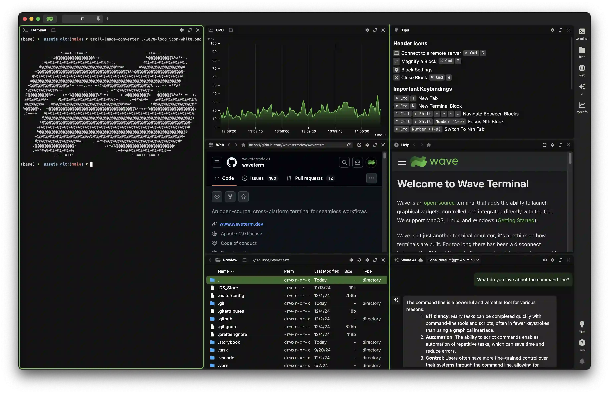

  <a href="https://www.waveterm.dev">
	<picture>
		<source media="(prefers-color-scheme: dark)" srcset="./assets/wave-dark.png">
		<source media="(prefers-color-scheme: light)" srcset="./assets/wave-light.png">
		
	</picture>
  </a>
   

# Wave Terminal

Wave is an open-source terminal that combines traditional terminal features with graphical capabilities like file previews, web browsing, and AI assistance. It runs on MacOS, Linux, and Windows.

Modern development involves constantly switching between terminals and browsers - checking documentation, previewing files, monitoring systems, and using AI tools. Wave brings these graphical tools directly into the terminal, letting you control them from the command line. This means you can stay in your terminal workflow while still having access to the visual interfaces you need.

## Key Features

- Flexible drag & drop interface to organize terminal blocks, editors, web browsers, and AI assistants
- Built-in editor for seamlessly editing remote files with syntax highlighting and modern editor features
- Rich file preview system for remote files (markdown, images, video, PDFs, CSVs, directories)
- Integrated AI chat with support for multiple models (OpenAI, Claude, Azure, Perplexity, Ollama)
- Command Blocks for isolating and monitoring individual commands with auto-close options
- One-click remote connections with full terminal and file system access
- Rich customization including tab themes, terminal styles, and background images
- Powerful `wsh` command system for managing your workspace from the CLI and sharing data between terminal sessions

## Installation

Wave Terminal works on macOS, Linux, and Windows.

Platform-specific installation instructions can be found [here](https://docs.waveterm.dev/gettingstarted).

You can also install Wave Terminal directly from: [www.waveterm.dev/download](https://www.waveterm.dev/download).

### Minimum requirements

Wave Terminal runs on the following platforms:

- macOS 11 or later (arm64, x64)
- Windows 10 1809 or later (x64)
- Linux based on glibc-2.28 or later (Debian 10, RHEL 8, Ubuntu 20.04, etc.) (arm64, x64)

The WSH helper runs on the following platforms:

- macOS 11 or later (arm64, x64)
- Windows 10 or later (arm64, x64)
- Linux Kernel 2.6.32 or later (x64), Linux Kernel 3.1 or later (arm64)

## Roadmap

Wave is constantly improving! Our roadmap will be continuously updated with our goals for each release. You can find it [here](./ROADMAP.md).

Want to provide input to our future releases? Connect with us on [Discord](https://discord.gg/XfvZ334gwU) or open a [Feature Request](https://github.com/wavetermdev/waveterm/issues/new/choose)!

## Links

- Homepage &mdash; https://www.waveterm.dev
- Download Page &mdash; https://www.waveterm.dev/download
- Documentation &mdash; https://docs.waveterm.dev
- Legacy Documentation &mdash; https://legacydocs.waveterm.dev
- Blog &mdash; https://blog.waveterm.dev
- X &mdash; https://x.com/wavetermdev
- Discord Community &mdash; https://discord.gg/XfvZ334gwU

## Building from Source

See [Building Wave Terminal](BUILD.md).

## Contributing

Wave uses GitHub Issues for issue tracking.

Find more information in our [Contributions Guide](CONTRIBUTING.md), which includes:

- [Ways to contribute](CONTRIBUTING.md#contributing-to-wave-terminal)
- [Contribution guidelines](CONTRIBUTING.md#before-you-start)

## License

Wave Terminal is licensed under the Apache-2.0 License. For more information on our dependencies, see [here](./ACKNOWLEDGEMENTS.md).
