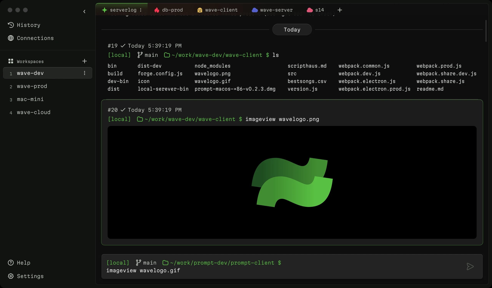

<p align="center">
  <picture>
    <source media="(prefers-color-scheme: dark)" srcset="./assets/waveterm-logo-horizontal-dark.png">
    <source media="(prefers-color-scheme: light)" srcset="./assets/waveterm-logo-horizontal-light.png">
    
  </picture>
  <br/>
</p>

# Wave Terminal

Wave is an open-source AI-native terminal built for seamless workflows.

Wave isn't just another terminal emulator; it's a rethink on how terminals are built. Wave combines command line with the power of the open web to help veteran CLI users and new developers alike.

-   Inline renderers to cut down on context switching. Render code, images, markdown, and CSV files without ever leaving the terminal.
-   Persistent sessions that can restore state across network disconnections and reboots
-   Searchable contextual command history across all remote sessions (saved locally)
-   Workspaces, tabs, and command blocks to keep you organized
-   CodeEdit, to edit local and remote files with a VSCode-like inline editor
-   AI Integration with ChatGPT (or ChatGPT compatible APIs) to help write commands and get answers inline



## Installation

Wave Terminal works with MacOS and Linux.

Install Wave Terminal from: [www.waveterm.dev/download](https://www.waveterm.dev/download)

Also available as a homebrew cask for MacOS:

```
brew install --cask wave
```

## Links

-   Homepage &mdash; https://www.waveterm.dev
-   Download Page &mdash; https://www.waveterm.dev/download
-   Documentation &mdash; https://docs.waveterm.dev/
-   Blog &mdash; https://blog.waveterm.dev/
-   Quick Start Guide &mdash; https://docs.waveterm.dev/quickstart/
-   Discord Community &mdash; https://discord.gg/XfvZ334gwU

## Building from Source

-   [MacOS Build Instructions](./BUILD.md)
-   [Linux Build Instructions](./build-linux.md)

## Contributing

Wave uses Github Issues for issue tracking.

Find more information in our [Contributions Guide](CONTRIBUTING.md), which includes:

-   [Ways to contribute](CONTRIBUTING.md#contributing-to-wave-terminal)
-   [Contribution guidelines](CONTRIBUTING.md#before-you-start)
