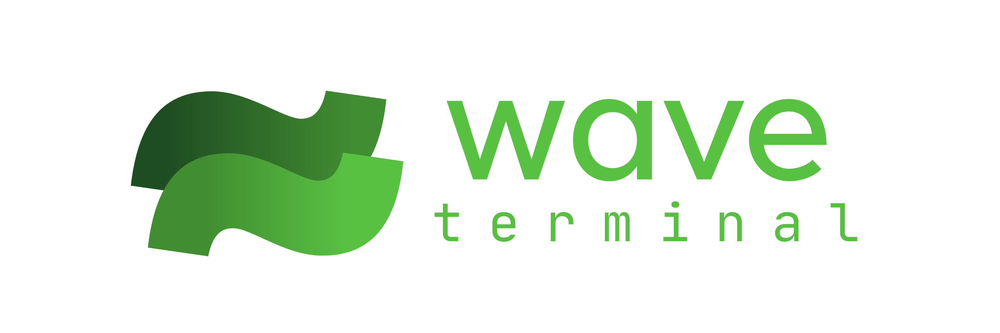
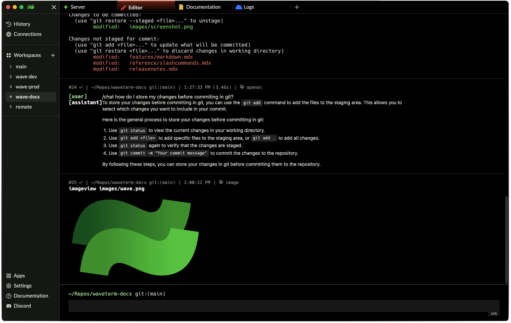

<p align="center">
  <picture>
    <source media="(prefers-color-scheme: dark)" srcset="./assets/waveterm-logo-horizontal-dark.png">
    <source media="(prefers-color-scheme: light)" srcset="./assets/waveterm-logo-horizontal-light.png">
    
  </picture>
  <br/>
</p>

# Wave Terminal

[](https://app.fossa.com/projects/git%2Bgithub.com%2Fwavetermdev%2Fwaveterm?ref=badge_shield)

Wave is an open-source terminal that can launch graphical widgets, controlled and integrated directly with the CLI. It includes a base terminal, directory browser, file previews (images, media, markdown), a graphical editor (for code/text files), a web browser, and integrated AI chat.

Wave isn't just another terminal emulator; it's a rethink on how terminals are built. For too long there has been a disconnect between the CLI and the web. If you want fast, keyboard-accessible, easy-to-write applications, you use the CLI, but if you want graphical interfaces, native widgets, copy/paste, scrolling, variable font sizes, then you'd have to turn to the web. Wave's goal is to bridge that gap.



## Installation

Wave Terminal works on MacOS, Linux, and Windows.

Install Wave Terminal from: [www.waveterm.dev/download](https://www.waveterm.dev/download)

Also available as a homebrew cask for MacOS:

```
brew install --cask wave
```

## Links

- Homepage &mdash; https://www.waveterm.dev
- Download Page &mdash; https://www.waveterm.dev/download
- Documentation &mdash; https://docs.waveterm.dev/
- Blog &mdash; https://blog.waveterm.dev/
- Discord Community &mdash; https://discord.gg/XfvZ334gwU

## Building from Source

We use `task` to build Wave.

```bash
brew install go-task
```

Once task is installed you can run this command to build and launch the development version of Wave. Note that the development database and settings are kept in a separate folder from the production version (~/.waveterm-dev) to prevent cross-corruption.

```bash
task electron:dev
```

## Contributing

Wave uses Github Issues for issue tracking.

Find more information in our [Contributions Guide](CONTRIBUTING.md), which includes:

- [Ways to contribute](CONTRIBUTING.md#contributing-to-wave-terminal)
- [Contribution guidelines](CONTRIBUTING.md#before-you-start)

## License

Wave Terminal is licensed under the Apache-2.0 License. For more information on our dependencies, see [here](./acknowledgements/README.md).
