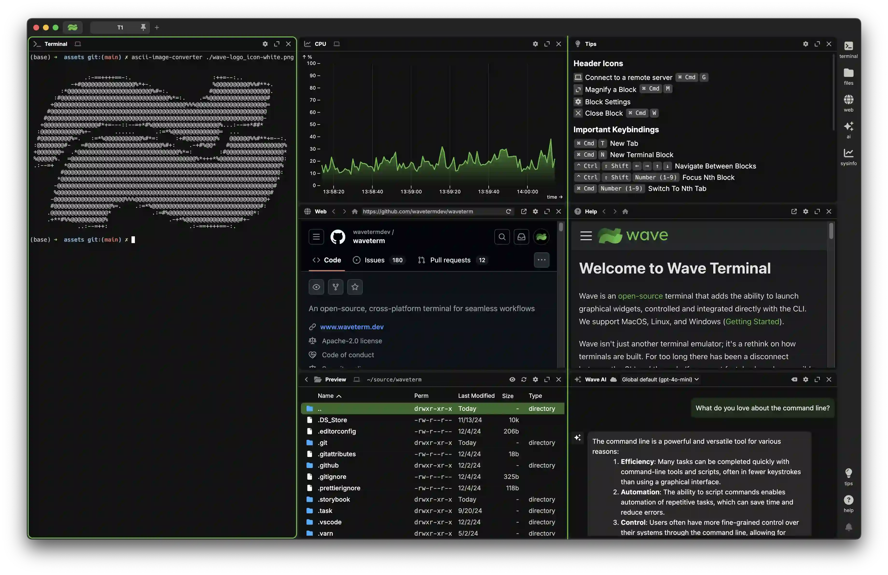

  <a href="https://remoteterm.io">
	<picture>
		<source media="(prefers-color-scheme: dark)" srcset="./assets/wave-dark.png">
		<source media="(prefers-color-scheme: light)" srcset="./assets/wave-light.png">
		
	</picture>
  </a>
   

> **Fork:** This is a fork of [Wave Terminal](https://github.com/wavetermdev/waveterm) optimized for remote development workflows.

# RemoteTerm

RemoteTerm is an open-source terminal for macOS, Linux, and Windows. No accounts required.

RemoteTerm supports durable SSH sessions that survive network interruptions and restarts, with automatic reconnection. Edit remote files with a built-in graphical editor and preview files inline without leaving the terminal.

## What's different

This fork is tuned for developers who work on remote machines, with the local app as a thin client.

**Sessions that heal themselves.** Durable SSH sessions survive network drops, laptop sleep/wake, VPN changes, and app restarts. When a connection drops it reconnects automatically.

**Remote work feels local.** Inline images render right in the terminal (Sixel, iTerm2, Kitty). Copy-and-paste screenshots and drag-and-drop files into remote sessions. Review, stage, commit, and push changes on any connected host with the built-in source-control sidebar.

**Your AI agents stay running.** Claude Code, Grok Build, OpenCode, and Pi work in the terminal — durable sessions survive disconnects, irrespective if your local machine is offline and inline images render their output.

**Your SSH config is automatically detected.** `LocalForward` / `RemoteForward` from `~/.ssh/config` are applied automatically — no extra setup.

**Private by default.** Zero telemetry, analytics, and cloud data collection. Always.

## Key Features

- Durable SSH Sessions - Remote terminal sessions survive connection interruptions, network changes, and app restarts with automatic reconnection
- Flexible drag & drop interface to organize terminal blocks, editors, web browsers, and previews
- Built-in editor for editing remote files with syntax highlighting and modern editor features
- Rich file preview system for remote files (markdown, images, video, PDFs, CSVs, directories)
- Quick full-screen toggle for any block - expand terminals, editors, and previews for better visibility, then instantly return to multi-block view
- Command Blocks for isolating and monitoring individual commands
- One-click remote connections with full terminal and file system access
- Secure secret storage using native system backends - store API keys and credentials locally, access them across SSH sessions
- Rich customization including tab themes, terminal styles, and background images
- Powerful `wsh` command system for managing your workspace from the CLI and sharing data between terminal sessions
- Connected file management with `wsh file` - seamlessly copy and sync files between local and remote SSH hosts
- Inline image rendering - display images directly in the terminal using Sixel, iTerm2, or Kitty protocols

## Download

Pre-built binaries are produced by GitHub Actions CI on the [fork's repo](https://github.com/whoisjeremylam/remoteterm) — grab the latest build from [Releases](https://github.com/whoisjeremylam/remoteterm/releases) or from the artifacts of a recent successful workflow run.

## Quickstart

1. Add a host to your `~/.ssh/config` (RemoteTerm reads it automatically).
2. Launch RemoteTerm.
3. Click the connection dropdown in the terminal header and pick your host.

Port forwarding (`LocalForward` / `RemoteForward`) from your SSH config is applied automatically — no extra setup.

## Installation

RemoteTerm works on macOS, Linux, and Windows.

### Minimum requirements

RemoteTerm runs on the following platforms:

- macOS 11 or later (arm64, x64)
- Windows 10 1809 or later (x64)
- Linux based on glibc-2.28 or later (Debian 10, RHEL 8, Ubuntu 20.04, etc.) (arm64, x64)

The WSH helper runs on the following platforms:

- macOS 11 or later (arm64, x64)
- Windows 10 or later (x64)
- Linux Kernel 2.6.32 or later (x64), Linux Kernel 3.1 or later (arm64)

## Building from Source

See [Building from Source](BUILD.md).

## Contributing

Issues and feature requests belong in [this fork's issue tracker](https://github.com/whoisjeremylam/remoteterm/issues) — please don't file fork-specific bugs against upstream Wave Terminal.

Find more information in our [Contributions Guide](CONTRIBUTING.md), which includes:

- [Ways to contribute](CONTRIBUTING.md#contributing-to-wave-terminal)
- [Contribution guidelines](CONTRIBUTING.md#before-you-start)

## License

RemoteTerm is licensed under the Apache-2.0 License. For more information on our dependencies, see [here](./ACKNOWLEDGEMENTS.md).

RemoteTerm is forked from [Wave Terminal](https://github.com/wavetermdev/waveterm) — all credit for the underlying platform goes to the upstream project.
