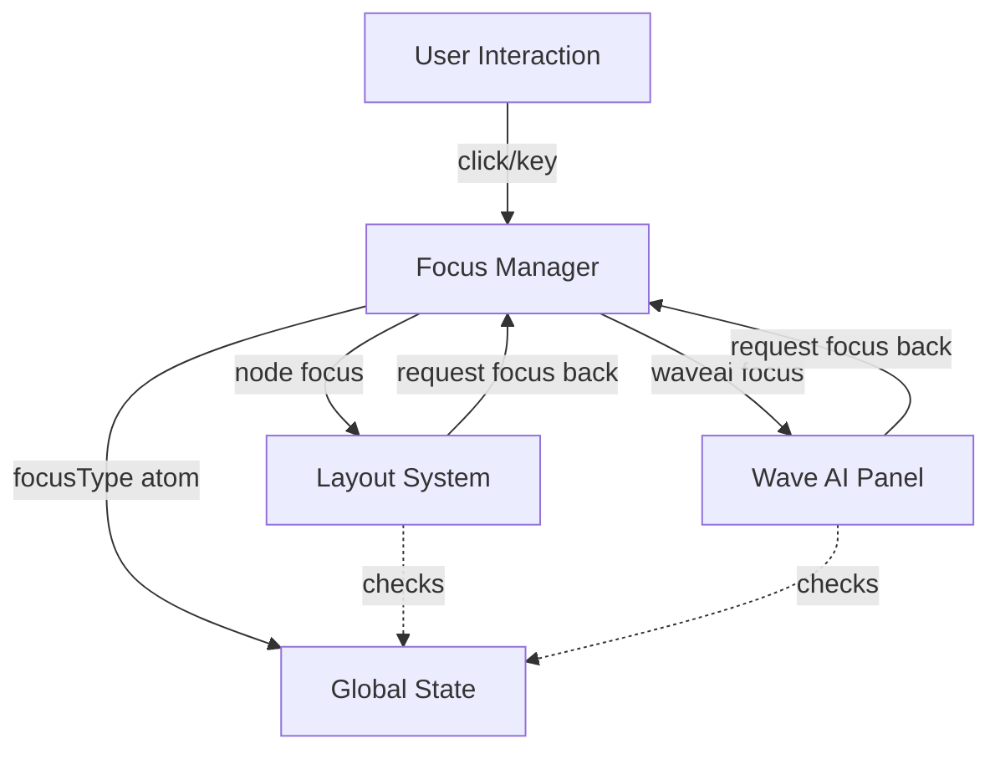
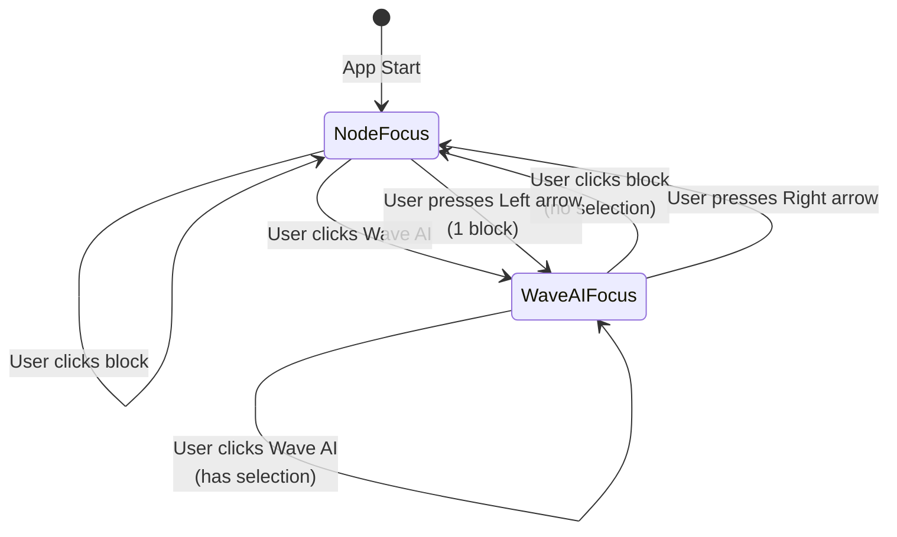

# Wave Terminal Focus System - Unified Architecture Plan

## Problem Analysis

### Current Issues

1. **Wave AI focus is too fragile** - Only watches textarea focus/blur, missing the sophisticated multi-phase handling that blocks have
2. **Selection handling breaks** - Selecting text in Wave AI causes blur → focus reverts to layout → selection is lost
3. **Focus ring flashing** - Clicking Wave AI briefly shows focus ring on layout before Wave AI gets focus
4. **Window blur sensitivity** - `window.blur()` unfocuses textarea → incorrectly assumes user wants to leave Wave AI
5. **No capture phase** - Missing the immediate visual feedback that blocks get via `onFocusCapture`

### Why the Block Focus System Works

From [`aiprompts/focus.md`](aiprompts/focus.md), the block system has:

1. **Multi-phase handling**:
   - `onFocusCapture` (mousedown) → immediate visual feedback
   - `onClick` → deferred DOM focus
2. **Selection protection**:
   - [`focusedBlockId()`](frontend/util/focusutil.ts:48-70) checks both activeElement AND selections
   - `focusWithin` prevents calling `setFocusTarget()` when selection exists
3. **View delegation**:
   - Views implement `giveFocus()` for custom focus handling
   - Allows terminal, code editor, etc. to manage their own focus

## Proposed Architecture

### Overview Diagram



### 1. Enhanced Focus Manager

**File**: [`frontend/app/store/focusManager.ts`](frontend/app/store/focusManager.ts)

**Responsibilities**:

- Single source of truth for application-level focus state
- Coordinates transitions between node focus and Wave AI focus
- Provides utility functions for checking focus state
- Handles refocus operations intelligently

**Key Enhancements**:

```typescript
class FocusManager {
  // Existing
  focusType: PrimitiveAtom<"node" | "waveai">;
  blockFocusAtom: Atom<string | null>;

  // NEW: Selection-aware focus checking
  waveAIFocusWithin(): boolean;
  nodeFocusWithin(): boolean;

  // NEW: Protected transitions (check selections first)
  requestNodeFocus(): void; // from Wave AI → node
  requestWaveAIFocus(): void; // from node → Wave AI

  // NEW: Get current focus type
  getFocusType(): FocusStrType;

  // ENHANCED: Smart refocus based on focusType
  refocusNode(): void; // already handles both types

  // NEW: Focus ring coordination
  shouldShowWaveAIFocusRing(): boolean;
  shouldShowNodeFocusRing(blockId: string): boolean;
}
```

### 2. Wave AI Focus Utilities

**New File**: [`frontend/app/aipanel/waveai-focus-utils.ts`](frontend/app/aipanel/waveai-focus-utils.ts)

Similar to [`focusutil.ts`](frontend/util/focusutil.ts) but for Wave AI:

```typescript
// Find if element is within Wave AI panel
export function findWaveAIPanel(element: HTMLElement): HTMLElement | null {
  let current: HTMLElement = element;
  while (current) {
    if (current.hasAttribute("data-waveai-panel")) {
      return current;
    }
    current = current.parentElement;
  }
  return null;
}

// Check if Wave AI panel has focus or selection (like focusedBlockId())
export function waveAIHasFocusWithin(): boolean {
  // Check if activeElement is within Wave AI panel
  const focused = document.activeElement;
  if (focused instanceof HTMLElement) {
    const waveAIPanel = findWaveAIPanel(focused);
    if (waveAIPanel) {
      return true;
    }
  }

  // Check if selection is within Wave AI panel
  const sel = document.getSelection();
  if (sel && sel.anchorNode && sel.rangeCount > 0 && !sel.isCollapsed) {
    let anchor = sel.anchorNode;
    if (anchor instanceof Text) {
      anchor = anchor.parentElement;
    }
    if (anchor instanceof HTMLElement) {
      const waveAIPanel = findWaveAIPanel(anchor);
      if (waveAIPanel) {
        return true;
      }
    }
  }

  return false;
}

// Check if there's an active selection in Wave AI
export function waveAIHasSelection(): boolean {
  const sel = document.getSelection();
  if (!sel || sel.rangeCount === 0 || sel.isCollapsed) {
    return false;
  }

  let anchor = sel.anchorNode;
  if (anchor instanceof Text) {
    anchor = anchor.parentElement;
  }
  if (anchor instanceof HTMLElement) {
    return findWaveAIPanel(anchor) != null;
  }

  return false;
}
```

### 3. Wave AI Panel Focus Handling

**File**: [`frontend/app/aipanel/aipanel.tsx`](frontend/app/aipanel/aipanel.tsx)

**Changes**:

```typescript
// ADD: Capture phase handler (like blocks)
const handleFocusCapture = useCallback((event: React.FocusEvent) => {
    console.log("Wave AI focus capture", getElemAsStr(event.target));
    focusManager.requestWaveAIFocus();  // Sets visual state immediately
}, []);

// MODIFY: Click handler to be focus-aware
const handleClick = (e: React.MouseEvent) => {
    const target = e.target as HTMLElement;
    const isInteractive = target.closest('button, a, input, textarea, select, [role="button"], [tabindex]');

    if (isInteractive) {
        return;
    }

    // NEW: Check for selection protection
    const hasSelection = waveAIHasSelection();
    if (hasSelection) {
        // Just update visual focus, don't move DOM focus
        focusManager.requestWaveAIFocus();
        return;
    }

    // No selection, safe to move DOM focus
    setTimeout(() => {
        if (!waveAIHasSelection()) {  // Double-check after timeout
            model.focusInput();
        }
    }, 0);
};

// Add data attribute and onFocusCapture to the div
<div
    data-waveai-panel="true"
    className={...}
    onFocusCapture={handleFocusCapture}
    onClick={handleClick}
    // ... rest
>
```

### 4. Wave AI Input Focus Handling

**File**: [`frontend/app/aipanel/aipanelinput.tsx`](frontend/app/aipanel/aipanelinput.tsx)

**Changes**:

```typescript
// MODIFY: handleFocus - advisory only
const handleFocus = useCallback(() => {
  // Still set the atom, but focus manager is the authority
  globalStore.set(atoms.waveAIFocusedAtom, true);
  focusManager.requestWaveAIFocus();
}, []);

// MODIFY: handleBlur - be smart about it
const handleBlur = useCallback((e: React.FocusEvent) => {
  const relatedTarget = e.relatedTarget;

  // Check if focus is moving to another element within Wave AI panel
  if (relatedTarget instanceof HTMLElement) {
    const waveAIPanel = findWaveAIPanel(relatedTarget);
    if (waveAIPanel) {
      // Focus staying within Wave AI, don't revert
      return;
    }
  }

  // Check if there's a selection in Wave AI
  if (waveAIHasSelection()) {
    // Selection exists, don't revert focus
    return;
  }

  // Check if this is a window blur (relatedTarget is null)
  if (relatedTarget === null) {
    // Window is losing focus (e.g., Cmd+Tab), don't change focus state
    return;
  }

  // Focus is truly leaving Wave AI, revert to node focus
  globalStore.set(atoms.waveAIFocusedAtom, false);
  focusManager.requestNodeFocus();
}, []);
```

### 5. Block Focus Integration

**File**: [`frontend/app/block/block.tsx`](frontend/app/block/block.tsx)

**Changes**: **NONE REQUIRED**

The block code works perfectly as-is! Here's the complete flow:

**When block child gets focus** (input field, terminal click, tab navigation):

```
1. handleChildFocus fires (capture phase)
     ↓
2. nodeModel.focusNode()
     ↓
3. layoutModel.focusNode(nodeId)
     ↓
4. treeReducer(FocusNodeAction)
     ↓
5. focusNode(treeState, action)  // Updates layoutState.focusedNodeId
     ↓
6. focusManager.requestNodeFocus()  ← PULLS FOCUS FROM WAVE AI
     ↓
7. focusType = "node" (synchronous)
     ↓
8. Atom commits, isFocused recalculates
     ↓
9. Two-step effect grants physical DOM focus
```

**The key insight**: `nodeModel.focusNode()` → `treeReducer` → `focusManager.requestNodeFocus()` happens automatically via Section 8's integration in `treeReducer`. The block doesn't need to know about the focus manager at all!

**Why this works**:
1. **`handleChildFocus`**: Updates visual focus immediately, calls `nodeModel.focusNode()`
2. **`nodeModel.focusNode()`**: Triggers layout tree update (Section 8)
3. **`treeReducer`**: Calls `focusManager.requestNodeFocus()` for FocusNode actions
4. **`setFocusTarget`**: Runs later, grants physical focus (after focus manager is updated)

**The separation of concerns is clean**:
- Blocks handle their own focus normally (unchanged code)
- Focus manager is updated via `treeReducer` (Section 8)
- Wave AI manages its own blur/selection logic
- No cross-component dependencies ✓

### 6. Keyboard Navigation Integration

**File**: [`frontend/app/store/keymodel.ts`](frontend/app/store/keymodel.ts)

**Changes**:

```typescript
function switchBlockInDirection(tabId: string, direction: NavigateDirection) {
  const layoutModel = getLayoutModelForTabById(tabId);

  // REPLACE: Direct atom check with focus manager
  // OLD: const inWaveAI = globalStore.get(atoms.waveAIFocusedAtom);
  // NEW:
  const focusType = focusManager.getFocusType();

  if (direction === NavigateDirection.Left) {
    const numBlocks = globalStore.get(layoutModel.numLeafs);
    if (focusType === "waveai") {
      return;
    }
    if (numBlocks === 1) {
      // Use focus manager instead of direct call
      focusManager.requestWaveAIFocus();
      return;
    }
  }

  // For right navigation, switch from Wave AI to blocks
  if (direction === NavigateDirection.Right && focusType === "waveai") {
    focusManager.requestNodeFocus();
    return;
  }

  // Rest of navigation logic...
}
```

### 7. Critical Integration: isFocused Atom

**File**: [`frontend/layout/lib/layoutModel.ts`](frontend/layout/lib/layoutModel.ts:936-941)

**The Existing Mechanism** (from [`aiprompts/focus-layout.md`](aiprompts/focus-layout.md)):

The system already has Wave AI integration! The `isFocused` atom checks `waveAIFocusedAtom`:

```typescript
isFocused: atom((get) => {
  const treeState = get(this.treeStateAtom);
  const isFocused = treeState.focusedNodeId === nodeid;
  const waveAIFocused = get(atoms.waveAIFocusedAtom); // ← Already integrated!
  return isFocused && !waveAIFocused; // Suppresses block focus when Wave AI focused
});
```

This prevents the two-step `useLayoutEffect` chain from granting physical DOM focus when Wave AI is focused.

**Why This Matters**:

- When `layoutState.focusedNodeId` changes → WaveObject updates → `isFocused` atoms recalculate
- If Wave AI is focused, `isFocused` returns `false` even if this node should be focused
- This prevents the block's two-step effect from running (see [`focus-layout.md`](aiprompts/focus-layout.md))
- Physical DOM focus stays with Wave AI ✓

**The Change We Need**:

Replace direct `waveAIFocusedAtom` check with focus manager:

```typescript
isFocused: atom((get) => {
  const treeState = get(this.treeStateAtom);
  const isFocused = treeState.focusedNodeId === nodeid;
  // NEW: Check focus manager instead of direct atom
  const focusType = get(focusManager.focusType);
  return isFocused && focusType === "node";
});
```

**This single change coordinates the entire system**:

- Layout can set `focusedNodeId` freely
- The reactive chain runs normally
- But `isFocused` returns `false` if focus manager says "waveai"
- Block's two-step effect doesn't run
- Physical DOM focus stays with Wave AI

### 8. Layout Model Focus Integration - CRITICAL TIMING

**The Problem**: When layout claims focus (e.g., Cmd+n inserting a new block), we need to pull focus from Wave AI. But the `isFocused` atom suppresses ALL blocks when `focusType === "waveai"`, preventing the two-step effect from running.

**The Race Condition**:

```
insertNode(focused: true)
  → focusedNodeId = newNode
  → generation++
  → Atom commits to WaveObject
  → isFocused recalculates
  → BUT focusType === "waveai"
  → isFocused returns FALSE ❌
  → Two-step effect doesn't run
  → Wave AI keeps focus incorrectly
```

**The Solution**: Update `focusManager` BEFORE the atom commits, so when `isFocused` recalculates, it sees the new `focusType`.

**File**: [`frontend/layout/lib/layoutModel.ts`](frontend/layout/lib/layoutModel.ts)

**Critical Timing in treeReducer**:

```typescript
treeReducer(action: LayoutTreeAction): boolean {
    // 1. Process the action (mutates treeState, increments generation)
    switch (action.type) {
        case LayoutTreeActionType.InsertNode:
            insertNode(this.treeState, action as LayoutTreeInsertNodeAction);
            // generation++ happened inside insertNode

            // 2. BEFORE atom commits, update focus manager if layout is claiming focus
            if ((action as LayoutTreeInsertNodeAction).focused) {
                focusManager.requestNodeFocus();  // ← SYNCHRONOUS, happens NOW
                // This updates focusType from "waveai" → "node" immediately
            }
            break;

        case LayoutTreeActionType.InsertNodeAtIndex:
            insertNodeAtIndex(this.treeState, action as LayoutTreeInsertNodeAtIndexAction);
            if ((action as LayoutTreeInsertNodeAtIndexAction).focused) {
                focusManager.requestNodeFocus();
            }
            break;

        case LayoutTreeActionType.FocusNode:
            focusNode(this.treeState, action as LayoutTreeFocusNodeAction);
            // Explicit focus change always claims focus
            focusManager.requestNodeFocus();
            break;

        case LayoutTreeActionType.MagnifyNodeToggle:
            magnifyNodeToggle(this.treeState, action as LayoutTreeMagnifyNodeToggleAction);
            // Magnifying also focuses the node
            focusManager.requestNodeFocus();
            break;

        // ... other cases ...
    }

    // 3. AFTER focus manager update, commit to atom
    //    (happens later in treeReducer via this.setter())
    // 4. isFocused recalculates and sees focusType === "node"
    // 5. Two-step effect runs and grants physical focus ✓
}
```

**Why This Works**:

1. **Synchronous update**: `focusManager.requestNodeFocus()` updates `focusType` immediately
2. **Before commit**: Called BEFORE `this.setter()` commits the treeState to the atom
3. **Reactive chain works**: When atom commits, `isFocused` sees the new `focusType` and returns true
4. **Two-step effect runs**: blockClicked triggers, `setFocusTarget()` grants physical focus
5. **No setTimeout needed**: Everything happens in the correct order naturally

**Order of Operations** (Single Tick, No Flash):

```
User presses Cmd+n
  ↓
treeReducer() called
  ↓
1. insertNode(focused: true) - SYNCHRONOUS
   - layoutState.focusedNodeId = newNode
   - layoutState.generation++
  ↓
2. focusManager.requestNodeFocus() - SYNCHRONOUS
   - globalStore.set(focusType, "node")
   - Atom updated immediately
  ↓
3. this.setter(treeStateAtom, ...) - SYNCHRONOUS
   - Tree state atom updated immediately
  ↓
[All in same tick - no intermediate renders]
  ↓
React re-renders (batched update)
  ↓
isFocused recalculates:
  - get(treeStateAtom) → focusedNodeId = newNode ✓
  - get(focusType) → "node" ✓
  - Returns TRUE for newNode
  ↓
useLayoutEffect #1: setBlockClicked(true)
  ↓
useLayoutEffect #2: setFocusTarget()
  ↓
Physical DOM focus granted ✓
```

**No Flash Because**:

- Both `focusManager.focusType` and `treeStateAtom` are updated synchronously in the same call stack
- Jotai batches notifications, so React re-renders once with BOTH updates applied
- The `isFocused` atom calculation sees the complete new state:
  - New `focusedNodeId` from tree state
  - New `focusType === "node"` from focus manager
- There is never an intermediate state where one is updated but not the other
- React sees the correct node focused immediately, in a single render

**Critical Implementation Detail**:
The `focusManager.requestNodeFocus()` call MUST happen in the same function call as the tree state update (inside `treeReducer`), before the function returns. This ensures both atom updates happen in the same synchronous execution context, which Jotai and React will batch together.

#### Solution B: Watch focusedNode Atom (Alternative)

**File**: New hook or effect in workspace/tab component

```typescript
// In workspace or tab-level component
useEffect(() => {
  const layoutModel = getLayoutModelForStaticTab();
  const unsubscribe = globalStore.sub(layoutModel.focusedNode, () => {
    const focusedNode = globalStore.get(layoutModel.focusedNode);
    if (focusedNode != null) {
      // Layout changed focus, notify focus manager
      focusManager.requestNodeFocus();
    }
  });
  return unsubscribe;
}, []);
```

**Why This Works**:

- Reactive: automatically triggered whenever `focusedNode` atom changes
- Catches ALL paths that modify focus (direct or indirect)
- Clean separation of concerns

**Recommendation**: Use Solution A (treeReducer hook) as it's more explicit and catches the exact moment of focus change, before any side effects occur.

### 7. Global Refocus Integration

**Files**: Search for `globalRefocus` and similar utilities

**Changes**:

```typescript
function globalRefocus() {
  // NEW: Use focus manager
  focusManager.refocusNode();

  // OLD: Direct calls to layoutModel.refocusNode(), etc.
}
```

## Implementation Details

### Focus State Machine



### Protection Logic Flow

**Wave AI Click with Selection**:

1. User selects text in Wave AI
2. User clicks elsewhere in Wave AI panel
3. `handleClick` → checks `waveAIHasSelection()` → true
4. Only calls `focusManager.requestWaveAIFocus()` (visual update)
5. Does NOT call `model.focusInput()` (which would clear selection)
6. Selection preserved ✓

**Wave AI Blur to Block**:

1. User clicks a block while in Wave AI
2. Block's `onFocusCapture` fires → `handleChildFocus`
3. Checks `focusManager.getFocusType()` → "waveai"
4. If Wave AI has selection, returns early (Wave AI keeps focus)
5. If no selection, proceeds with block focus
6. Wave AI's `handleBlur` fires
7. Checks `waveAIHasSelection()` → false
8. Calls `focusManager.requestNodeFocus()`
9. Focus transfers cleanly ✓

## Edge Cases and Solutions

### 1. Window Blur (⌘+Tab to other app)

**Problem**: Textarea loses focus, triggers `handleBlur`
**Solution**: `handleBlur` checks `relatedTarget` - if null, it's a window blur, don't revert focus

### 2. Rapid Clicking Between Areas

**Problem**: Race conditions between focus manager updates
**Solution**: Focus manager uses atomic updates, capture phase provides immediate feedback

### 3. Copy/Paste Context Menu

**Problem**: Right-click causes blur
**Solution**: Context menu opens on `relatedTarget` within Wave AI, `handleBlur` detects this and doesn't revert

### 4. Drag to Select Across Boundaries

**Problem**: Selection starts in Wave AI, drags outside
**Solution**: `waveAIHasSelection()` checks if selection anchorNode is within Wave AI panel

### 5. Modal Dialogs

**Problem**: Modal opens, steals focus from Wave AI
**Solution**: Modal closes → `globalRefocus()` → focus manager restores correct focus based on `focusType`

## Migration Strategy

### Phase 1: Focus Manager Foundation

1. Implement enhanced `focusManager.ts` with new methods
2. Create `waveai-focus-utils.ts` with selection utilities
3. Add data attributes to Wave AI panel
4. Test utilities in isolation

### Phase 2: Wave AI Integration

1. Add `onFocusCapture` to Wave AI panel
2. Update `handleBlur` with selection protection
3. Update `handleClick` with selection awareness
4. Test Wave AI focus in isolation

### Phase 3: Layout Integration

1. Update `block.tsx` to check focus manager
2. Update keyboard navigation
3. Update `globalRefocus` and similar utilities
4. Test transitions between Wave AI and blocks

### Phase 4: Polish

1. Remove old `waveAIFocusedAtom` direct usage
2. Add console logging for debugging (can be stripped in production)
3. Performance testing
4. User acceptance testing

## Testing Checklist

- [ ] Select text in Wave AI, click elsewhere in Wave AI → selection preserved
- [ ] Click Wave AI panel (not input) → focus moves to Wave AI, input focused
- [ ] Click Wave AI panel while selecting → no focus flash
- [ ] Click block while in Wave AI (no selection) → focus moves to block
- [ ] Click block while selecting in Wave AI → selection protected
- [ ] Press Left arrow in single block → Wave AI focused
- [ ] Press Right arrow in Wave AI → block focused
- [ ] Window blur (⌘+Tab) → focus state preserved
- [ ] Open context menu in Wave AI → doesn't lose focus
- [ ] Rapid clicking between areas → no race conditions
- [ ] Modal opens/closes → focus restores correctly

## Files to Create/Modify

### New Files

1. `frontend/app/aipanel/waveai-focus-utils.ts` - Focus utilities for Wave AI

### Modified Files

1. [`frontend/app/store/focusManager.ts`](frontend/app/store/focusManager.ts) - Enhanced with new methods
2. [`frontend/app/aipanel/aipanel.tsx`](frontend/app/aipanel/aipanel.tsx) - Add capture phase, improve click handler
3. [`frontend/app/aipanel/aipanelinput.tsx`](frontend/app/aipanel/aipanelinput.tsx) - Smart blur handling
4. [`frontend/app/block/block.tsx`](frontend/app/block/block.tsx) - Check focus manager before stealing focus
5. [`frontend/app/store/keymodel.ts`](frontend/app/store/keymodel.ts) - Use focus manager for navigation
6. Search and update all `globalRefocus` and similar calls

### Testing Files

1. Manual testing checklist (above)
2. Consider adding integration tests for focus transitions

## Benefits

1. **Selection protection** - Like blocks, Wave AI selections are preserved
2. **No focus flash** - Capture phase provides immediate visual feedback
3. **Robust blur handling** - Smart detection of where focus is going
4. **Unified model** - Single source of truth simplifies reasoning
5. **Extensible** - Easy to add new focus contexts (e.g., future sidebar)
6. **Debuggable** - Console logging shows focus state transitions clearly

## Implementation Priority

1. **Critical**: Wave AI selection protection (most user-visible bug)
2. **High**: Focus ring flash fix (visual annoyance)
3. **Medium**: Window blur handling (edge case but confusing)
4. **Low**: Full keyboard navigation integration (nice to have)

## Notes

- This design mirrors the proven block focus system from [`aiprompts/focus.md`](aiprompts/focus.md)
- Focus manager becomes the single source of truth, preventing race conditions
- Selection checking happens before any focus state changes
- Capture phase provides immediate visual feedback without disrupting interactions
