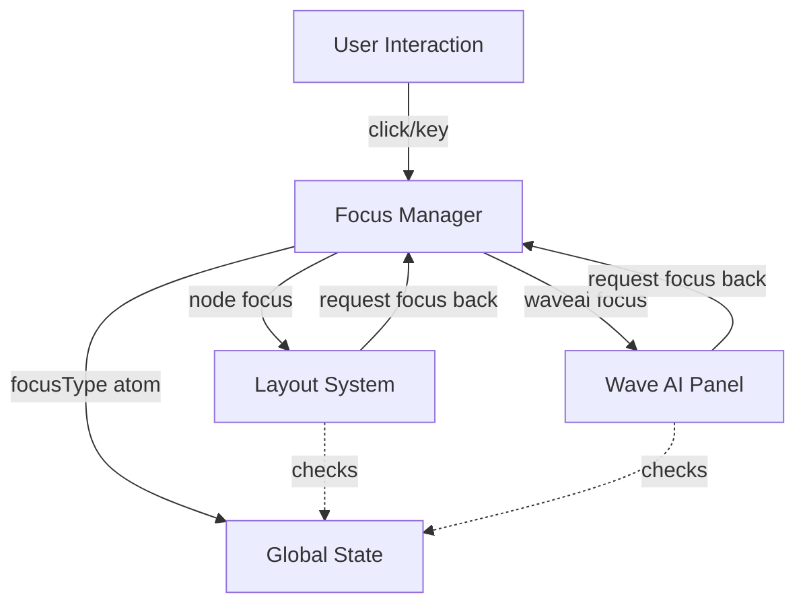

# Wave Terminal Focus System - Wave AI Integration

## Problem

Wave AI focus handling is fragile compared to blocks:

1. Only watches textarea focus/blur, missing the multi-phase handling that blocks have
2. Selection handling breaks - selecting text causes blur → focus reverts to layout
3. Focus ring flashing - clicking Wave AI briefly shows focus ring on layout
4. Window blur sensitivity - `window.blur()` incorrectly assumes user wants to leave Wave AI
5. No capture phase - missing the immediate visual feedback that blocks get

## Solution Overview

Extend the block focus system pattern to Wave AI:

- Multi-phase handling (capture + click)
- Selection protection
- Focus manager coordination
- View delegation

## Architecture



## Focus Manager Enhancements

**File**: [`frontend/app/store/focusManager.ts`](frontend/app/store/focusManager.ts)

Add selection-aware focus methods:

```typescript
class FocusManager {
  // Existing
  focusType: PrimitiveAtom<"node" | "waveai">;  // Single source of truth
  blockFocusAtom: Atom<string | null>;

  // NEW: Selection-aware focus checking
  waveAIFocusWithin(): boolean;
  nodeFocusWithin(): boolean;

  // NEW: Focus transitions (INTENTIONALLY not defensive)
  requestNodeFocus(): void; // from Wave AI → node (BREAKS selections - that's the point!)
  requestWaveAIFocus(): void; // from node → Wave AI

  // NEW: Get current focus type
  getFocusType(): FocusStrType;

  // ENHANCED: Smart refocus based on focusType
  refocusNode(): void; // already handles both types
}
```

**Critical Design Decision: `requestNodeFocus()` is NOT defensive**

When `requestNodeFocus()` is called (e.g., Cmd+n, explicit focus change), it MUST take focus even if there's a selection in Wave AI. This is intentional - the user explicitly requested a focus change. Losing the selection is the correct behavior.

**Focus Manager as Source of Truth**

The `focusType` atom is the single source of truth. The old `waveAIFocusedAtom` will be kept in sync during migration but should eventually be removed. All components should read `focusManager.focusType` directly (via `useAtomValue`) to determine focus ring state - this ensures synchronized, reactive focus ring updates.

## Wave AI Focus Utilities

**New File**: [`frontend/app/aipanel/waveai-focus-utils.ts`](frontend/app/aipanel/waveai-focus-utils.ts)

Similar to [`focusutil.ts`](frontend/util/focusutil.ts) but for Wave AI:

```typescript
// Find if element is within Wave AI panel
export function findWaveAIPanel(element: HTMLElement): HTMLElement | null {
  let current: HTMLElement = element;
  while (current) {
    if (current.hasAttribute("data-waveai-panel")) {
      return current;
    }
    current = current.parentElement;
  }
  return null;
}

// Check if Wave AI panel has focus or selection (like focusedBlockId())
export function waveAIHasFocusWithin(): boolean {
  // Check if activeElement is within Wave AI panel
  const focused = document.activeElement;
  if (focused instanceof HTMLElement) {
    const waveAIPanel = findWaveAIPanel(focused);
    if (waveAIPanel) return true;
  }

  // Check if selection is within Wave AI panel
  const sel = document.getSelection();
  if (sel && sel.anchorNode && sel.rangeCount > 0 && !sel.isCollapsed) {
    let anchor = sel.anchorNode;
    if (anchor instanceof Text) {
      anchor = anchor.parentElement;
    }
    if (anchor instanceof HTMLElement) {
      const waveAIPanel = findWaveAIPanel(anchor);
      if (waveAIPanel) return true;
    }
  }

  return false;
}

// Check if there's an active selection in Wave AI
export function waveAIHasSelection(): boolean {
  const sel = document.getSelection();
  if (!sel || sel.rangeCount === 0 || sel.isCollapsed) {
    return false;
  }

  let anchor = sel.anchorNode;
  if (anchor instanceof Text) {
    anchor = anchor.parentElement;
  }
  if (anchor instanceof HTMLElement) {
    return findWaveAIPanel(anchor) != null;
  }

  return false;
}
```

## Wave AI Panel Integration

**File**: [`frontend/app/aipanel/aipanel.tsx`](frontend/app/aipanel/aipanel.tsx)

Add capture phase and selection protection:

```typescript
// ADD: Capture phase handler (like blocks)
const handleFocusCapture = useCallback((event: React.FocusEvent) => {
    console.log("Wave AI focus capture", getElemAsStr(event.target));
    focusManager.requestWaveAIFocus();  // Sets visual state immediately
}, []);

// MODIFY: Click handler with selection protection
const handleClick = (e: React.MouseEvent) => {
    const target = e.target as HTMLElement;
    const isInteractive = target.closest('button, a, input, textarea, select, [role="button"], [tabindex]');

    if (isInteractive) {
        return;
    }

    // NEW: Check for selection protection
    const hasSelection = waveAIHasSelection();
    if (hasSelection) {
        // Just update visual focus, don't move DOM focus
        focusManager.requestWaveAIFocus();
        return;
    }

    // No selection, safe to move DOM focus
    setTimeout(() => {
        if (!waveAIHasSelection()) {  // Double-check after timeout
            model.focusInput();
        }
    }, 0);
};

// Add data attribute and onFocusCapture to the div
<div
    data-waveai-panel="true"
    className={...}
    onFocusCapture={handleFocusCapture}
    onClick={handleClick}
    // ... rest
>
```

## Wave AI Input Focus Handling

**File**: [`frontend/app/aipanel/aipanelinput.tsx`](frontend/app/aipanel/aipanelinput.tsx)

Smart blur handling:

```typescript
// MODIFY: handleFocus - advisory only
const handleFocus = useCallback(() => {
  focusManager.requestWaveAIFocus();
}, []);

// MODIFY: handleBlur - simplified with waveAIHasFocusWithin()
const handleBlur = useCallback((e: React.FocusEvent) => {
  // Window blur - preserve state
  if (e.relatedTarget === null) {
    return;
  }

  // Still within Wave AI (focus or selection) - don't revert
  if (waveAIHasFocusWithin()) {
    return;
  }

  // Focus truly leaving Wave AI, revert to node focus
  focusManager.requestNodeFocus();
}, []);
```

**Note:** `waveAIHasFocusWithin()` checks both:

1. If `relatedTarget` is within Wave AI panel (handles context menus, buttons)
2. If there's an active selection in Wave AI (handles text selection clicks)

This combines both checks from the original implementation into a single utility call.

## Block Focus Integration

**File**: [`frontend/app/block/block.tsx`](frontend/app/block/block.tsx)

**No changes needed in block.tsx** - the block code works perfectly as-is!

**How it works:**

When a block child gets focus (input field, terminal click, tab navigation):

```
1. handleChildFocus fires (capture phase)
     ↓
2. nodeModel.focusNode()
     ↓
3. layoutModel.focusNode(nodeId)
     ↓
4. treeReducer(FocusNodeAction)
     ↓
5. focusManager.requestNodeFocus() (see Layout Focus Coordination section)
     ↓
6. Updates localTreeStateAtom (synchronous)
     ↓
7. isFocused recalculates (sees focusType = "node")
     ↓
8. Two-step effect grants physical DOM focus
```

The focus manager update happens automatically in the treeReducer for all focus-claiming operations.

## Layout Focus Integration

**File**: [`frontend/layout/lib/layoutModel.ts`](frontend/layout/lib/layoutModel.ts)

The `isFocused` atom already checks Wave AI state:

```typescript
isFocused: atom((get) => {
  const treeState = get(this.localTreeStateAtom);
  const isFocused = treeState.focusedNodeId === nodeid;
  const waveAIFocused = get(atoms.waveAIFocusedAtom);
  return isFocused && !waveAIFocused;
});
```

**Update to use focus manager:**

```typescript
isFocused: atom((get) => {
  const treeState = get(this.localTreeStateAtom);
  const isFocused = treeState.focusedNodeId === nodeid;
  const focusType = get(focusManager.focusType);
  return isFocused && focusType === "node";
});
```

This single change coordinates the entire system:

- Layout can set `focusedNodeId` freely
- The reactive chain runs normally
- But `isFocused` returns `false` if focus manager says "waveai"
- Block's two-step effect doesn't run
- Physical DOM focus stays with Wave AI

## Layout Focus Coordination

**File**: [`frontend/layout/lib/layoutModel.ts`](frontend/layout/lib/layoutModel.ts)

**Critical Integration**: When layout operations claim focus, they must update the focus manager synchronously.

```typescript
treeReducer(action: LayoutTreeAction, setState = true): boolean {
  // Process the action (mutates this.treeState)
  switch (action.type) {
    case LayoutTreeActionType.InsertNode:
      insertNode(this.treeState, action);
      // If inserting with focus, claim focus from Wave AI
      if ((action as LayoutTreeInsertNodeAction).focused) {
        focusManager.requestNodeFocus();
      }
      break;

    case LayoutTreeActionType.InsertNodeAtIndex:
      insertNodeAtIndex(this.treeState, action);
      if ((action as LayoutTreeInsertNodeAtIndexAction).focused) {
        focusManager.requestNodeFocus();
      }
      break;

    case LayoutTreeActionType.FocusNode:
      focusNode(this.treeState, action);
      // Explicit focus change always claims focus
      focusManager.requestNodeFocus();
      break;

    case LayoutTreeActionType.MagnifyNodeToggle:
      magnifyNodeToggle(this.treeState, action);
      // Magnifying also focuses the node
      focusManager.requestNodeFocus();
      break;

    // ... other cases don't affect focus
  }

  if (setState) {
    this.updateTree();
    this.setter(this.localTreeStateAtom, { ...this.treeState });
    this.persistToBackend();
  }

  return true;
}
```

**Why This Works:**

1. `focusManager.requestNodeFocus()` updates `focusType` synchronously
2. Called BEFORE atoms commit (still in same function)
3. When `localTreeStateAtom` commits, `isFocused` sees the new `focusType`
4. Both updates happen in same tick → React sees consistent state
5. No race conditions, no flash

**Order of Operations:**

```
Cmd+n pressed
  ↓
treeReducer() executes
  ↓
1. insertNode() mutates layoutState.focusedNodeId
2. focusManager.requestNodeFocus() updates focusType
3. setter(localTreeStateAtom) commits tree state
  ↓
[All synchronous - single call stack]
  ↓
React re-renders with both updates applied
  ↓
isFocused sees: focusedNodeId = newNode AND focusType = "node"
  ↓
Two-step effect grants physical focus
```

## Keyboard Navigation Integration

**File**: [`frontend/app/store/keymodel.ts`](frontend/app/store/keymodel.ts)

Use focus manager instead of direct atom checks:

```typescript
function switchBlockInDirection(tabId: string, direction: NavigateDirection) {
  const layoutModel = getLayoutModelForTabById(tabId);
  const focusType = focusManager.getFocusType();

  if (direction === NavigateDirection.Left) {
    const numBlocks = globalStore.get(layoutModel.numLeafs);
    if (focusType === "waveai") {
      return;
    }
    if (numBlocks === 1) {
      focusManager.requestWaveAIFocus();
      return;
    }
  }

  // For right navigation, switch from Wave AI to blocks
  if (direction === NavigateDirection.Right && focusType === "waveai") {
    focusManager.requestNodeFocus();
    return;
  }

  // Rest of navigation logic...
}
```

## Focus Flow

### Complete Flow (Single Tick, No Flash)

```
User presses Cmd+n
  ↓
treeReducer() called
  ↓
1. insertNode(focused: true) - SYNCHRONOUS
   - layoutState.focusedNodeId = newNode
  ↓
2. setter(localTreeStateAtom, { ...treeState }) - SYNCHRONOUS
   - Atom updated immediately
  ↓
3. persistToBackend() - ASYNC (fire-and-forget)
  ↓
[All in same tick - no intermediate renders]
  ↓
React re-renders (batched update)
  ↓
isFocused recalculates:
  - get(localTreeStateAtom) → focusedNodeId = newNode ✓
  - get(focusType) → checks current focus type
  - Returns TRUE if focusType === "node"
  ↓
useLayoutEffect #1: setBlockClicked(true)
  ↓
useLayoutEffect #2: setFocusTarget()
  ↓
Physical DOM focus granted ✓
```

**Why there's no flash:**

- Local atoms update synchronously
- React batches the updates
- Everything sees consistent state in one render

## Edge Cases

### 1. Window Blur (⌘+Tab to other app)

- Textarea loses focus, triggers `handleBlur`
- `relatedTarget` is null → detected as window blur
- Focus state preserved

### 2. Selection in Wave AI

- User selects text
- Clicks elsewhere in Wave AI
- `waveAIHasSelection()` returns true
- Only visual focus updates, no DOM focus change
- Selection preserved

### 3. Copy/Paste Context Menu

- Right-click causes blur
- `relatedTarget` within Wave AI panel
- `handleBlur` detects this, doesn't revert focus

### 4. Modal Dialogs

- Modal opens, steals focus
- Modal closes → `globalRefocus()`
- Focus manager restores correct focus based on `focusType`

## Implementation Steps

### 1. Focus Manager Foundation

- Implement enhanced `focusManager.ts` with new methods
- Create `waveai-focus-utils.ts` with selection utilities
- Add data attributes to Wave AI panel

### 2. Wave AI Integration

- Add `onFocusCapture` to Wave AI panel
- Update `handleBlur` with simplified `waveAIHasFocusWithin()` check
- Update `handleClick` with selection awareness
- Components read `focusManager.focusType` directly via `useAtomValue` for focus ring display

### 3. Layout Integration

- Update `isFocused` atom to check `focusManager.focusType`
- Add `focusManager.requestNodeFocus()` calls in `treeReducer` for focus-claiming operations
- Update keyboard navigation to use `focusManager.getFocusType()`

### 4. Testing

- Test all transitions and edge cases
- Verify selection protection works
- Confirm no focus ring flashing
- Verify focus rings are synchronized through focus manager

## Files to Create/Modify

### New Files

- `frontend/app/aipanel/waveai-focus-utils.ts` - Focus utilities for Wave AI

### Modified Files

- [`frontend/app/store/focusManager.ts`](frontend/app/store/focusManager.ts) - Enhanced with new methods
- [`frontend/app/aipanel/aipanel.tsx`](frontend/app/aipanel/aipanel.tsx) - Add capture phase, improve click handler
- [`frontend/app/aipanel/aipanelinput.tsx`](frontend/app/aipanel/aipanelinput.tsx) - Smart blur handling
- [`frontend/layout/lib/layoutModel.ts`](frontend/layout/lib/layoutModel.ts) - Update isFocused atom AND add focus manager calls in treeReducer
- [`frontend/app/store/keymodel.ts`](frontend/app/store/keymodel.ts) - Use focus manager for navigation

## Testing Checklist

- [ ] Select text in Wave AI, click elsewhere in Wave AI → selection preserved
- [ ] Click Wave AI panel (not input) → focus moves to Wave AI
- [ ] Click block while in Wave AI (no selection) → focus moves to block
- [ ] Press Left arrow in single block → Wave AI focused
- [ ] Press Right arrow in Wave AI → block focused
- [ ] Window blur (⌘+Tab) → focus state preserved
- [ ] Open context menu in Wave AI → doesn't lose focus
- [ ] Modal opens/closes → focus restores correctly

## Benefits

1. **Selection protection** - Wave AI selections preserved like blocks
2. **No focus flash** - Capture phase provides immediate visual feedback
3. **Robust blur handling** - Smart detection of where focus is going
4. **Unified model** - Single source of truth simplifies reasoning
5. **Simple reactivity** - Everything updates synchronously in one tick
6. **No timing issues** - Local atoms eliminate race conditions

## Phased Implementation Approach

The changes can be broken into safe, independently testable phases. Each phase can be shipped and tested before proceeding to the next.

### Phase 1: Foundation (Non-Breaking, Fully Testable)

**Add focus manager methods WITHOUT changing existing code**

```typescript
// In focusManager.ts - ADD these methods
class FocusManager {
  // NEW methods that ALSO update the old waveAIFocusedAtom during migration
  requestWaveAIFocus(): void {
    globalStore.set(this.focusType, "waveai");
    globalStore.set(atoms.waveAIFocusedAtom, true); // ← Keep old atom in sync during migration!
  }

  requestNodeFocus(): void {
    // NO defensive checks - when called, we TAKE focus (selections may be lost)
    globalStore.set(this.focusType, "node");
    globalStore.set(atoms.waveAIFocusedAtom, false); // ← Keep old atom in sync during migration!
  }

  getFocusType(): FocusStrType {
    return globalStore.get(this.focusType);
  }

  waveAIFocusWithin(): boolean {
    return waveAIHasFocusWithin();
  }

  nodeFocusWithin(): boolean {
    return focusedBlockId() != null;
  }
}
```

**Why this is safe:**

- Doesn't change any existing code
- Focus manager updates BOTH new `focusType` AND old `waveAIFocusedAtom` during migration
- Everything keeps working exactly as before
- Can test focus manager methods in isolation
- Components can read `focusType` directly via `useAtomValue` for reactive updates
- No user-visible changes

**Testing:**

- Call the new methods manually in console
- Verify both atoms update correctly
- Verify existing focus behavior unchanged

---

### Phase 2: Wave AI Improvements (Testable in Isolation)

**Add utilities and improve Wave AI focus handling**

1. Create `waveai-focus-utils.ts` with selection checking utilities
2. Update `aipanel.tsx`:
   - Add `data-waveai-panel` attribute
   - Add `onFocusCapture` handler
   - Improve click handler with selection protection
   - Call `focusManager.requestWaveAIFocus()` instead of setting atom directly
3. Update `aipanelinput.tsx`:
   - Smart blur handling with selection checks
   - Call `focusManager.requestNodeFocus()` instead of setting atom directly

**Why this is safe:**

- Wave AI now uses focus manager, but focus manager keeps old atom in sync
- Blocks still read `waveAIFocusedAtom` directly - still works!
- Can test Wave AI selection protection independently
- If there's a bug, only Wave AI is affected
- Blocks remain completely unchanged

**Testing:**

- Wave AI selection preservation when clicking within panel
- Wave AI blur handling (window blur, context menus, etc.)
- Verify blocks still work normally (unchanged)
- Test transitions between Wave AI and blocks

**User-visible improvements:**

- Wave AI text selections no longer lost when clicking in panel
- No focus ring flashing
- Better window blur handling

---

### Phase 3: Layout isFocused Migration (Single Critical Change)

**Update isFocused atom to use focus manager**

```typescript
// In layoutModel.ts - CHANGE isFocused atom
isFocused: atom((get) => {
  const treeState = get(this.localTreeStateAtom);
  const isFocused = treeState.focusedNodeId === nodeid;
  const focusType = get(focusManager.focusType); // ← Use focus manager
  return isFocused && focusType === "node";
});
```

**Why this is safe:**

- Focus manager already keeps `waveAIFocusedAtom` in sync (Phase 1)
- Wave AI already uses focus manager (Phase 2)
- Blocks read the new `focusType` but it's always consistent with old atom
- Should be completely transparent
- Single file change - easy to revert if issues

**Testing:**

- Focus transitions between blocks still work
- Wave AI → block transitions work
- Block → Wave AI transitions work
- Keyboard navigation still works
- All existing functionality preserved

**No user-visible changes** - just internal refactoring

---

### Phase 4: Layout Focus Coordination (Completes the System)

**Add focus manager calls to treeReducer**

```typescript
// In layoutModel.ts treeReducer - ADD focus manager calls
case LayoutTreeActionType.FocusNode:
  focusNode(this.treeState, action);
  focusManager.requestNodeFocus();  // ← NEW
  break;

case LayoutTreeActionType.InsertNode:
  insertNode(this.treeState, action);
  if ((action as LayoutTreeInsertNodeAction).focused) {
    focusManager.requestNodeFocus();  // ← NEW
  }
  break;

case LayoutTreeActionType.MagnifyNodeToggle:
  magnifyNodeToggle(this.treeState, action);
  focusManager.requestNodeFocus();  // ← NEW
  break;
```

**Why this is safe:**

- Just makes explicit what was already happening via Wave AI's blur handler
- Ensures focus manager is updated even when layout programmatically changes focus
- Makes the system more robust
- Small, focused changes in one file

**Testing:**

- Cmd+n creates new block with correct focus
- Magnify toggle works correctly
- Programmatic focus changes work
- Focus stays consistent during rapid operations

**User-visible improvements:**

- More robust focus handling during programmatic layout changes
- Edge cases with rapid focus changes handled better

---

### Phase 5: Keyboard Nav & Cleanup (Optional Polish)

**Use focus manager in keyboard navigation, remove old atom usage**

1. Update `keymodel.ts` to use `focusManager.getFocusType()`
2. Remove direct `atoms.waveAIFocusedAtom` usage throughout codebase
3. (Optional) Stop syncing `waveAIFocusedAtom` in focus manager - can be deprecated

**Why this is safe:**

- Everything already using focus manager under the hood
- Just cleanup/optimization
- Can be done incrementally

**Testing:**

- Keyboard navigation between blocks
- Left/Right arrow to/from Wave AI
- All keyboard shortcuts still work

---

## Key Insight: Dual Atom Sync

**Phase 1 is the enabler**: By having the focus manager update BOTH the new `focusType` atom AND the old `waveAIFocusedAtom`, we create a safe transition period where:

- New code can use focus manager
- Old code continues reading the old atom
- Everything stays consistent
- Each phase is independently testable
- Can ship and test after each phase

This dual-sync approach eliminates the "all or nothing" problem. You can stop at any phase and have a working, tested system.

## Testing Between Phases

After each phase, you can ship and test:

- **Phase 1** → No user-visible changes, foundation in place
- **Phase 2** → Wave AI improvements only, blocks unchanged
- **Phase 3** → Complete system working with new architecture
- **Phase 4** → More robust edge case handling
- **Phase 5** → Code cleanup and optimization

Each phase builds on the previous one but can be independently verified.
