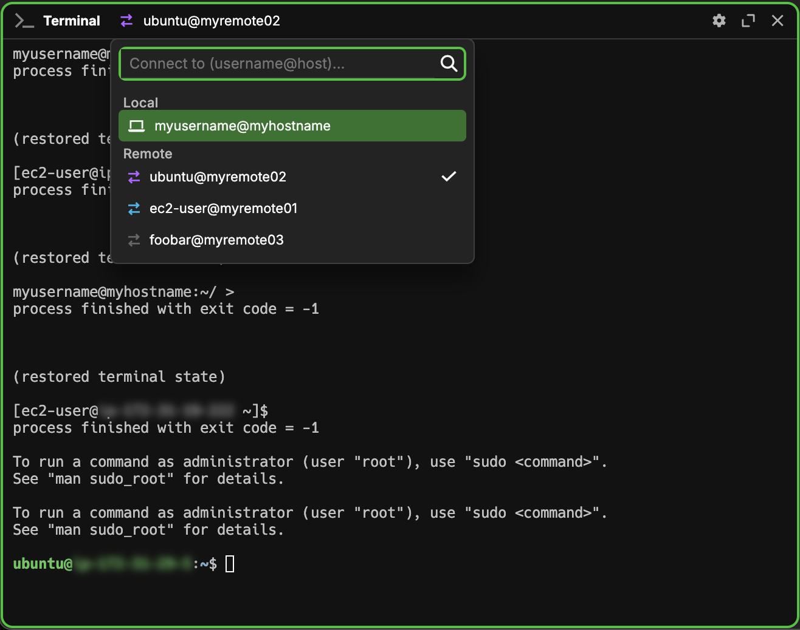

import { VersionBadge } from "@site/src/components/versionbadge";

# Connections

Wave allows users to connect to various machines and unify them together in a way that preserves the unique behavior of each. At the moment, this extends to SSH remote connections, local WSL connections, and AWS S3 buckets.

## Access a Connection in a Block

The easiest way to access connections is to click the <i className="fa-sharp fa-laptop"/> icon. From there, you can type one of the following to depending on the connection you want:

For SSH Connections:

- `[user]@[host]`
- `[host]`
- `[user]@[host]:[port]`

For WSL Connections:

- `wsl://<distribution name>`

For AWS S3 Connections:

- `aws:[profile]`

Alternatively, if the connection already exists in the dropdown list, you can either click it or navigate to it with arrow keys and press enter to connect.



## Different Types of Connections

As there are several different types of connections, not all of the types have access to the same features. For instance, AWS S3 connections can only be used in preview widgets (directory, image viewer, code editor, etc.). Meanwhile, SSH and WSL connections can always work in terminal widgets, and if `wsh` shell extensions are installed, they can also work in preview widgets and the sysinfo widget.

As such, certain features will not be available for certain types of connections. As an example, AWS S3 connections cannot run startup scripts as they are not capable of running scripts.

## What are wsh Shell Extensions?

`wsh` is a small program that helps manage waveterm regardless of which machine you are currently connected to. It is always included on your host machine, but you also have the option to install it when connecting to SSH and WSL Connections. If it is installed on the connection, it is installed at `~/.waveterm/bin/wsh`. Then, when wave connects to your connection (and only when wave connects to your connection), the following happens:

- `~/.waveterm/bin` is added to your `PATH` for that individual session. This allows the user to use the `wsh` command without providing the complete path.
- Several environment variables are injected into the session to make certain tasks with `wsh` easier. These are [listed below](#additional-environment-variables).
- The user-defined environment variables in the `cmd:env` entry of`connections.json` are injected into the session.
- The user-defined initialization scripts located in `connections.json` are run. For more information on these scripts, see the section below.

If this fails for some reason, Wave will attempt to run without `wsh`. You will see this indicated by a small **<code><i className="fa-link-slash fa-solid fa-sharp"/></code>** icon in the block header. For more info on what `wsh` is capable of, see [wsh command](/wsh). And if you wish to view the source code of `wsh`, you can find it [here](https://github.com/wavetermdev/waveterm/tree/main/cmd/wsh).

With `wsh` installed, you have the ability to view certain widgets from the remote machine as if it were your host, for instance the `files` and `sysinfo` widgets. In addition, `wsh` can be used to influence the widgets across various machines. As a simple example, you can close a widget on the host machine by using the `wsh` command in a terminal window on a remote machine. For more information on what you can accomplish with `wsh`, take a look [here](/wsh).

### Additional Environment Variables

As mentioned above, `wsh` injects a few environment variables in remote sessions for the user's convenience. These are listed below:

| Variable Name        | Description                                                                   |
| -------------------- | ----------------------------------------------------------------------------- |
| TERM_PROGRAM         | Set to `waveterm` in wave.                                                    |
| WAVETERM             | This is set to 1 in wave.                                                     |
| WAVETERM_BLOCKID     | The id of the block containing your current terminal widget.                  |
| WAVETERM_CLIENTID    | The id of the RPC Client being used by your current terminal widget.          |
| WAVETERM_CONN        | The name of the remote connection being used by your current terminal widget. |
| WAVETERM_TABID       | The id of the tab containing your current terminal widget.                    |
| WAVETERM_VERSION     | The current semver version of wave.                                           |
| WAVETERM_WORKSPACEID | The id of thw workspace containing your current terminal widget.              |

# Initialization Scripts

Wave provides you with options for running initialization scripts on your remote machines when connecting to them. These are defined in `connections.json` and can take either the form of the path of a script or a short script written directly in the file. If multiple scripts are defined, the most specific one relevant to the current shell is applied. The keywords for the scripts are:

| Script Keyword      | Shells Where Applied |
| ------------------- | -------------------- |
| cmd:initscript      | all shells           |
| cmd:initscript.sh   | bash and zsh         |
| cmd:initscript.bash | bash                 |
| cmd:initscript.zsh  | zsh                  |
| cmd:initscript.pwsh | pwsh                 |
| cmd:initscript.fish | fish                 |

## Add a New Connection to the Dropdown

The SSH values that are loaded into the dropdown by default are obtained by parsing the internal `config/connections.json` file in addition to your `~/.ssh/config` and `/etc/ssh/ssh_config` files. Adding a new connection can be added in a couple ways:

- adding a new `Host` to one of your ssh config files, typically the `~/.ssh/config` file
- adding a new entry in the internal `config/connections.json` file
- manually typing your connection into the connection box (if this successfully connects, the connection will be added to the internal `config/connections.json` file)
- use `wsh ssh [user]@[host]` in your terminal (if this successfully connects, the connection will be added to the internal `config/connections.json` file)

WSL connections are added by searching the installed WSL distributions as they appear in the Windows Registry. They also exist in the `config/connections.json` file similarly to SSH connections.

AWS S3 Connections are added by parsing the `~/.aws/config` file. Unlike the SSH and WSL connections, these are not stored in the `config/connections.json` file.

## SSH Config Parsing

At the moment, we are capable of parsing any SSH config file that does not contain the `Match` keyword. This keyword is incompatible with a library we are using, but we are hoping to fix that soon. While all other valid keywords are parsed, we only support the functionality of a small subset of them at the moment:
| Keyword | Description |
|---------|-------------|
| Host | The pattern to match when attempting to connect via `[user]@[host]`. We list hosts that do not contain any wildcards characters (`*`, `?`, or `!`). Even if a host pattern contains wildcards, it will still be parsed when determining the values associated with the keys as usual.|
| User | The user of the SSH remote connection. This will default to the current user on the local machine if not specified.|
|HostName| The real host name of the machine to log into. An IP address can be used if desired. This will default to the Host if not specified.
| Port | The port to connect to the remote on. `22` is the default if not specified.|
| IdentityFile | This can be specified more than once per host. It gives the path to a private identity file (id_rsa, id_ed25519, id_ecdsa, etc.) that is used to authenticate the connection. Each will be tried in order, and they can be encrypted with a passphrase if desired. If no value is set, the default is to try in order: ~/.ssh/id_rsa, ~/.ssh/id_ecdsa, ~/.ssh/id_ecdsa_sk, ~/.ssh/id_ed25519_sk, ~/.ssh/id_dsa.|
|BatchMode| If set to true, user interaction via password, challenge/response, and publickey passphrase authentication will be disabled. It is set to false by default.|
|PubkeyAuthentication| (partial) This is used to specify if pubkey authentication should be attempted. It is partially implementented as the `unbound` and `host-bound` values simply work the same as the `yes` value. The default is `yes`.|
|PasswordAuthentication| This is used to specify if password authentication should be attempted. The default is `yes`.|
|KbdInteractiveAuthentication| This is used to specify if keyboard-interactive authentication should be attempted. The default is `yes`.|
|PreferredAuthentications| (partial) Specifies the order the client should attempt to authenticate in. It is partially implemented as it does not support `gssapi-with-mic` or `hostbased` authentication. The default is `publickey,keyboard-interactive,password`|
|AddKeysToAgent| (partial) This option will automatically add keys and their corresponding passphrase to your running ssh agent if it is enabled. It is partially supported as it can only accept `yes` and `no` as valid inputs. Other inputs such as `confirm` or a time interval will behave the same as `no`. The default value is `no`.|
|IdentityAgent| Specifies the Unix Domain Socket used to communicate with the SSH Agent. This is used to overwrite the SSH_AUTH_SOCK identity agent.|
|IdentitiesOnly| Specifies that only the specified authentication identity files should be used. This is either the default files or the ones specified with the IdentityFile keyword. It can accept `yes` or `no`. The default value is `no`.|
|ProxyJump| Specifies one or more jump proxies in a comma separated list. Each will be visited sequentially using TCP forwarding before connecting to the desired connection (also using TCP forwarding). It can be set to `none` to disable the feature.|
|UserKnownHostsFile| Provides the location of one or more user host key database files for recording trusted remote connections. The filenames are entered in the same string and separated by whitespace. The default value is `"~/.ssh/known_hosts ~/.ssh/known_hosts2"`.|
|GlobalKnownHostsFile| Provides the location of one or more global host key database files for recording trusted remote connections. The filenames are entered in the same string and separated by whitespace. The default value is `"/etc/ssh/ssh_known_hosts /etc/ssh/ssh_known_hosts2"`.|

### Example SSH Config Host

For a quick example, a host in your config file may look like:

```
Host myhost
   User username
   HostName 203.0.113.254
   IdentityFile ~/.ssh/id_rsa
   AddKeysToAgent yes
```

You would then be able to access this connection with `myhost` or `username@myhost`. And if you wanted to manually specify a port such as port 2222, you could do that by either adding `Port 2222` to the config file or connecting to `username@myhost:2222`.

## Internal SSH Configuration

In addition to the regular ssh config file, wave also has its own config file to manage separate variables. These include
| Keyword | Description |
|---------|-------------|
| conn:wshenabled | This boolean allows `wsh` to be used for your connection, if it is set to `false`, `wsh` will never be used for that connection. It defaults to `true`.|
| conn:askbeforewshinstall | This boolean is used to prompt the user before installing wsh. If it is set to false, `wsh` will automatically be installed instead without prompting. It defaults to `true`.|
| conn:wshpath | A string indicating the path to the `wsh` executable on the connection. It defaults to `"~/.waveterm/bin/wsh"`.|
| conn:shellpath | A string indicating the path to the shell executable on the connection. If not set, the output of `$SHELL` on the connection will be used.|
| conn:ignoresshconfig | This boolean allows wave to ignore the `~/.ssh/config` file for resolving keywords for this connection. The regular defaults will be used, but all changes to those must be specified in the `connections.json` file instead. This defaults to false.|
| display:hidden | This boolean hides the connection from the dropdown list. It defaults to `false` |
| display:order | This float determines the order of connections in the connection dropdown. It defaults to `0`.|
| term:fontsize | This int can be used to override the terminal font size for blocks using this connection. The block metadata takes priority over this setting. It defaults to null which means the global setting will be used instead. |
| term:fontfamily | This string can be used to specify a terminal font family for blocks using this connection. The block metadata takes priority over this setting. It defaults to null which means the global setting will be used instead. |
| term:theme | This string can be used to specify a terminal theme for blocks using this connection. The block metadata takes priority over this setting. It defaults to null which means the global setting will be used instead. |
| cmd:env | A json object with key value pairs of environment variables and the value they should be set to for this remote. This only works if `wsh` is enabled.
| cmd:initscript | A script or a path to a script that runs when initializing this connection with any shell. This only works if `wsh` is enabled. |
| cmd:initscript.sh | A script or a path to a script that runs when initializing this connection with POSIX shells like `bash` or `zsh`. This only works if `wsh` is enabled.
| cmd:initscript.bash | A script or a path to a script that runs when initializing this connection with the `bash` shell. This only works if `wsh` is enabled. |
| cmd:initscript.zsh | A script or a path to a script that runs when initializing this connection with the `zsh` shell. This only works if `wsh` is enabled. |
| cmd:initscript.pwsh | A script or a path to a script that runs when initializing this connection with the `pwsh` shell. This only works if `wsh` is enabled. |
| cmd:initscript.fish | A script or a path to a script that runs when initializing this connection with the `fish` shell. This only works if `wsh` is enabled. |
| ssh:user | A string that indicates the username of the connection. Can be used to override the value in `~/.ssh/config` or to set it if the ssh config is being ignored.|
| ssh:hostname | A string representing the internal hostname of the connection. Can be used to override the value in `~/.ssh/config` or to set it if the ssh config is being ignored.|
| ssh:port | A string to indicate the numerical port to connect on. Can be used to override the value in `~/.ssh/config` or to set it if the ssh config is being ignored.|
| ssh:identityfile | A list of strings containing the paths to identity files that will be used. If a `wsh ssh` command using the `-i` flag is successful, the identity file will automatically be added here. These are used before the `~/.ssh/config` values.|
| ssh:identitiesonly | A boolean indicating if only the specified identity files should be used. This means only the files set with the `ssh:identityfile` flag or the defaults. Can be used to override the value in `~/.ssh/config` or to set it if the ssh config is being ignored.|
| ssh:batchmode | A boolean indicating if password and passphrase prompts should be skipped. Can be used to override the value in `~/.ssh/config` or to set it if the ssh config is being ignored.|
| ssh:pubkeyauthentication | A boolean indicating if public key authentication is enabled. Can be used to override the value in `~/.ssh/config` or to set it if the ssh config is being ignored.|
| ssh:passwordauthentication | A boolean indicating if password authentication is enabled. Can be used to override the value in `~/.ssh/config` or to set it if the ssh config is being ignored. |
| ssh:passwordsecretname | A string specifying the name of a secret stored in the [secret store](/secrets) to use as the SSH password. When set, this password will be automatically used for password authentication instead of prompting the user. <VersionBadge version="v0.13" /> |
| ssh:kbdinteractiveauthentication | A boolean indicating if keyboard interactive authentication is enabled. Can be used to override the value in `~/.ssh/config` or to set it if the ssh config is being ignored. |
| ssh:preferredauthentications | A list of strings indicating an ordering of different types of authentications. Each authentication type will be tried in order. This supports `"publickey"`, `"keyboard-interactive"`, and `"password"` as valid types. Other types of authentication are not handled and will be skipped. Can be used to override the value in `~/.ssh/config` or to set it if the ssh config is being ignored.|
| ssh:addkeystoagent | A boolean indicating if the keys used for a connection should be added to the ssh agent. Can be used to override the value in `~/.ssh/config` or to set it if the ssh config is being ignored.|
| ssh:identityagent | A string giving the path to the unix domain socket of the identity agent. Can be used to overwrite the value in `~/.ssh/config` or to set it if the ssh config is being ignored.|
| ssh:proxyjump | A list of strings specifying the names of hosts that must be successively visited with tcp forwarding to establish a connection. Can be used to overwrite the value in `~/.ssh/config` or to set it if the ssh config is being ignored.|
| ssh:userknownhostsfile | A list containing the paths of any user host key database files used to keep track of authorized connections. Can be used to overwrite the value in `~/.ssh/config` or to set it if the ssh config is being ignored.|
| ssh:globalknownhostsfile | A list containing the paths of any global host key database files used to keep track of authorized connections. Can be used to overwrite the value in `~/.ssh/config` or to set it if the ssh config is being ignored.|

### Example Internal Configurations

Here are a couple examples of things you can do using the internal configuration file `connections.json`:

#### Hiding a Connection

Suppose you have a connection named `github.com` in your `~/.ssh/config` file that shows up as `git@github.com` in the connections dropdown. While it does belong in the config file for authentication reasons, it makes no sense to be in the dropdown since it doesn't involve connecting to a remote environment. In that case, you can hide it as in the example below:

```json
{
    <... other connections go here ...>,
    "git@github.com" : {
        "display:hidden": true
    },
    <... other connections go here ...>
}
```

#### Moving a Connection

Suppose you have a connection named `rarelyused` that shows up as `myusername@rarelyused:9999` in the connections dropdown. Since it's so rarely used, you would prefer to move it later in the list. In that case, you can move it as in the example below:

```json
{
    <... other connections go here ...>,
    "myusername@rarelyused:9999" : {
        "display:order": 100
    },
    <... other connections go here ...>
}
```

#### Theming a Connection

Suppose you have a connection named `myhost` that shows up as `myusername@myhost` in the connections dropdown. You use this connection a lot, but you keep getting it mixed up with your local connections. In this case, you can use the internal configuration file to style it differently. For example:

```json
{
    <... other connections go here ...>,
    "myusername@myhost" : {
        "term:theme": "warmyellow",
        "term:fontsize": 16,
        "term:fontfamily": "menlo"
    },
    <... other connections go here ...>
}
```

This style, font size, and font family will then only apply to the widgets that are using this connection.

### Entirely Defined Internally

Suppose you want to set up a connection but have no desire to learn the syntax of `~/.ssh/config`. In this case, you can entirely define the connection in your `connections.json` file. For example:

```json
{
    <... other connections go here ...>,
    "myusername@myhost" : {
        "ssh:hostname": "190.0.2.0",
        "ssh:identityfile": ["~/.ssh/myidentityfile"],
        "ssh:identitiesonly": true,
        "ssh:addkeystoagent": true
    },
    <... other connections go here ...>
}
```

This will create a connection without that connection needing to be in the `~/.ssh/config` file. A couple additional options are set as well as an example of how that can be done.

### Disabling wsh for a Connection

While Wave provides an option disable `wsh` when first connecting to a remote, there are cases where you may wish to disable it afterward. The easiest way to do this is by editing the `connections.json` file. Suppose the connection shows up in the dropdown as `root@wshless`. Then you can disable it manually with the following line:

```json
{
    <... other connections go here ...>,
    "root@wshless" : {
        "conn:enablewsh": false,
    },
    <... other connections go here ...>
}
```

Note that this same line gets added to your `connections.json` file automatically when you choose to disable `wsh` in gui when initially connecting.

## Managing Connections with the CLI

The `wsh` command gives some commands specifically for interacting with the connections. You can view these [here](/wsh-reference#conn).

## Troubleshooting Connections

### Log Files

If there are issues with connections, the easiest first step is to enable debugging in a terminal widget that is trying to connect. To do this, click the **<code><i className="fa-gear fa-solid fa-sharp"/></code>** button and hover over the **`Debug Connection`** item. From there you can select two log levels, `Info` and `Verbose`. After this, debug info will print out to the terminal during the connection.

If this is not sufficient, it is also possible to view the full log file. To do this, you can run the command `wsh wavepath log` to get the location of a log file.

### Known Limitations

In the case that there is an error setting up `wsh`, your connection will still launch without `wsh`. However, depending on the debug info, there are a few things that can cause this.

#### Shell Type

Wave is capable of injecting `wsh` in the following shells:

- bash
- zsh
- pwsh (powershell)
- fish

If the shell is different than those, it is possible the `wsh` command will not work by default. The easiest way to fix this at the moment is the switch the shell type. This can be done by setting the `conn:shellpath` value with a path to one of the above shells in the `connections.json` file for the connection you are trying to use. Alternatively, you can use the `chsh` command to change the shell in that connection, but this will also take effect outside of wave. Once this is done, restart wave for the changes to take effect.

#### AllowTcpForwarding in sshd

Some systems have sshd configured to disable TCP forwarding by default. This can be found on the connection in the `/etc/ssh/sshd_config` file. In that file, search for the line containing `AllowTcpForwarding`. If this is set to `no`, it is likely the reason `wsh` will not work on your connection. In order to get `wsh` working, set the value for `AllowTcpForwarding` to either `yes` or `local` (they both provide different levels of permission but both work in this case). Then, restart the `sshd` service with whichever method your remote machine provides. Once that is done, restart wave, so it can reconnect with this change.
