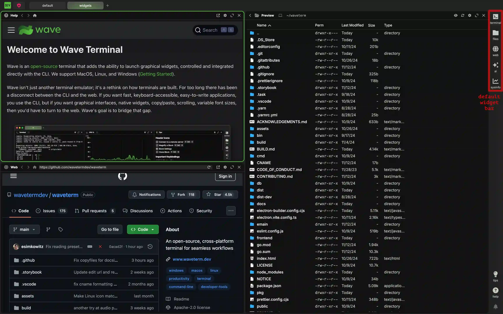
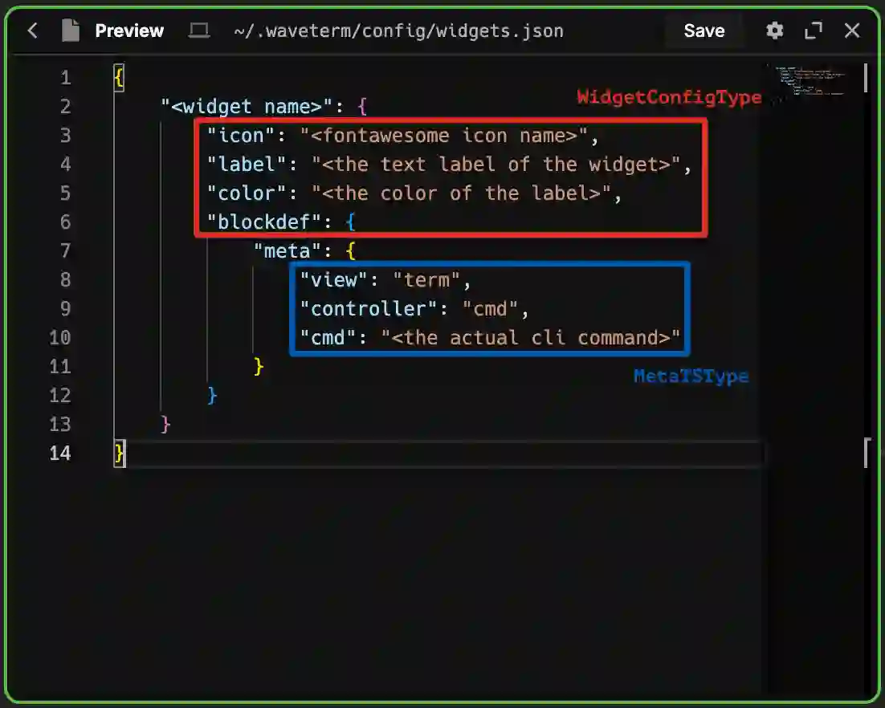
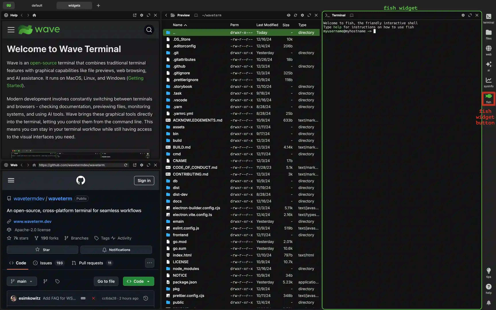
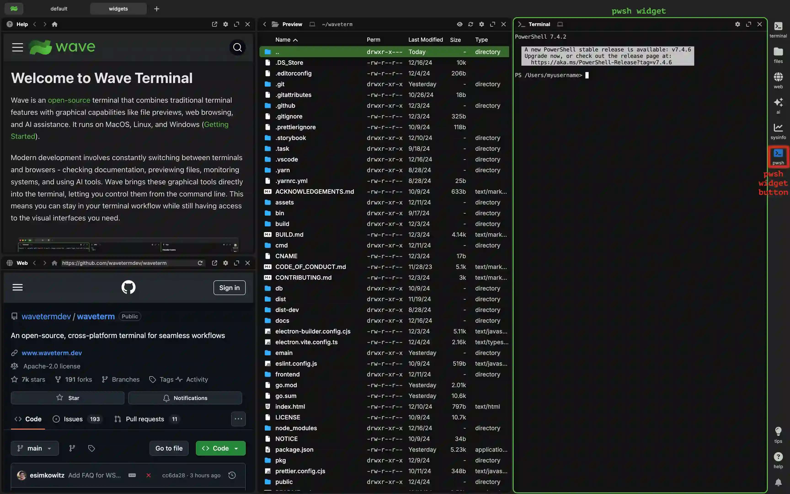
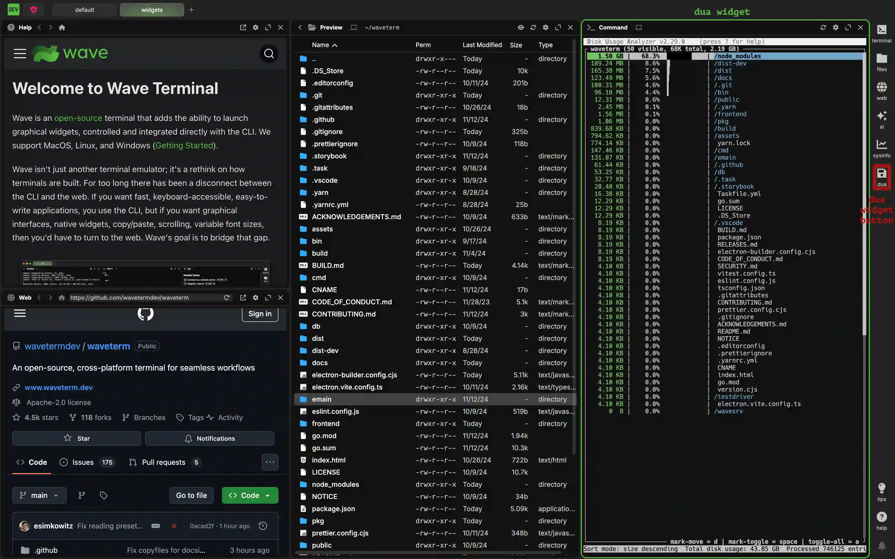
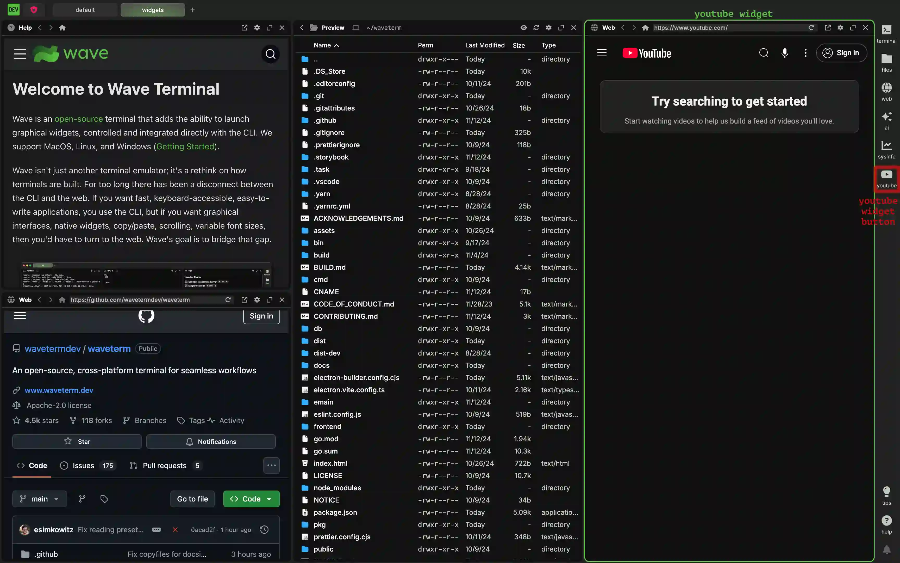
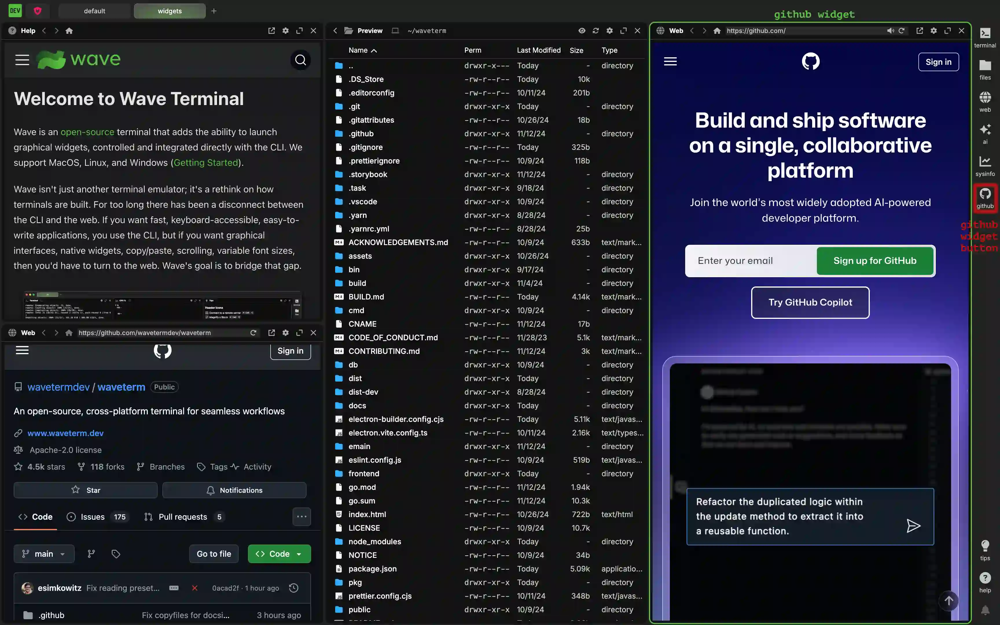

# Custom Widgets

Wave allows users to create their own widgets to uniquely customize their experience for what works for them. While we plan on greatly expanding on this in the future, it is already possible to make some widgets that you can access at the press of a button. All widgets can be created by modifying the `<WAVETERM_HOME>/config/widgets.json` file. By adding a widget to this file, it is possible to add widgets to the widget bar. By default, the widget bar looks like this:


By adding additional widgets, it is possible to get a widget bar that looks like this:


## The Structure of a Widget

All widgets share a similar structure that roughly looks like the example below:

```json
"<widget name>": {
    "icon": "<font awesome icon name>",
    "label": "<the text label of the widget>",
    "color": "<the color of the label>",
    "blockdef": {
        "meta": {
            "view": "term",
            "controller": "cmd",
            "cmd": "<the actual cli command>"
        }
    }
}
```

This consists of a couple different parts. First and foremost, each widget has a unique identifying name. The value associated with this name is the outer `WidgetConfigType`. It is outlined in red below:



This `WidgetConfigType` is shared between all types of widgets. That is to say, all widgets&mdash;regardless of type&mdash; will use the same keys for this. The accepted keys are:

| Key             | Description                                                                                                                                                                                                                                                                                |
| --------------- | ------------------------------------------------------------------------------------------------------------------------------------------------------------------------------------------------------------------------------------------------------------------------------------------ |
| "display:order" | (optional) Overrides the order of widgets with a number in case you want the widget to be different than the order provided in the `widgets.json` file. Defaults to 0.                                                                                                                     |
| "icon"          | (optional) The name of a [font awesome icon](#font-awesome-icons). Defaults to `"browser"`.                                                                                                                                                                                                |
| "color"         | (optional) A string representing a color as would be used in CSS. Hex codes and custom CSS properties are included. This defaults to `"var(--secondary-text-color)"` which is a color wave uses for text that should be differentiated from other text. Out of the box, it is `"#c3c8c2"`. |
| "label"         | (optional) A string representing the label that appears underneath the widget. It will also act as a tooltip on hover if the `"description"` key isn't filled out. It is null by default.                                                                                                  |
| "description"   | (optional) A description of what the widget does. If it is specified, this serves as a tooltip on hover. It is null by default.                                                                                                                                                            |
| "magnified"     | (optional) A boolean indicating whether or not the widget should launch magnfied. It is false by default.                                                                                                                                                                                  |
| "blockdef"      | This is where the the non-visual portion of the widget is defined. Note that all further definition takes place inside a meta object inside this one.                                                                                                                                      |

<a name="font-awesome-icons" />
:::info

**Font Awesome Icons**

[Font Awesome](https://fontawesome.com/search) provides a ton of useful icons that you can use as a widget icon in your app. At its simplest, you can just provide the icon name and it will be used. For example, the string `"house"`, will provide an icon containing a house. We also allow you to apply a few different styles to your icon by modifying the name as follows:

| format                         | description                                                                                                                                                                                           |
| ------------------------------ | ----------------------------------------------------------------------------------------------------------------------------------------------------------------------------------------------------- |
| &lt;icon&nbsp;name&gt;         | The plain icon with no additional styles applied.                                                                                                                                                     |
| solid@&lt;icon&nbsp;name&gt;   | Adds the `fa-solid` class to the icon to fill in the content with a fill color rather than leaving it a background.                                                                                   |
| regular@&lt;icon&nbsp;name&gt; | Adds the `fa-regular` class to the icon to ensure the content will not have a fill color and will use a standard outline instead.                                                                     |
| brands@&lt;icon&nbsp;name&gt;  | This is required to add the required `fa-brands` class to an icon associated with a brand. Without this, brand icons will not render properly. This will not work with icons that aren't brand icons. |

:::

The other options are part of the inner `MetaTSType` (outlined in blue in the image). This contains all of the details about how the widget actually works. The valid keys vary with each type of widget. They will be individually explored in more detail below.

## Terminal and CLI Widgets

A terminal widget, or CLI widget, is a widget that simply opens a terminal and runs a CLI command. They tend to look something like the example below:

```json
{
    <... other widgets go here ...>,
    "<widget name>": {
        "icon": "<font awesome icon name>",
        "label": "<the text label of the widget>",
        "color": "<the color of the label>",
        "blockdef": {
            "meta": {
                "view": "term",
                "controller": "cmd",
                "cmd": "<the actual cli command>"
            }
        }
    },
    <... other widgets go here ...>
}
```

The `WidgetConfigType` takes the usual options common to all widgets. The `MetaTSType` can include the keys listed below:

| Key                    | Description                                                                                                                                                                                                                                                                        |
| ---------------------- | ---------------------------------------------------------------------------------------------------------------------------------------------------------------------------------------------------------------------------------------------------------------------------------- |
| "view"                 | A string that specifies the general type of widget. In the case of custom terminal widgets, this must be set to `"term"`.                                                                                                                                                          |
| "controller"           | A string that specifies the type of command being used. For more persistent shell sessions, set it to "shell". For one off commands, set it to `"cmd"`. When `"cmd"` is set, the widget has an additional refresh button in its header that allows the command to be re-run.       |
| "cmd"                  | (optional) When the `"controller"` is set to `"cmd"`, this option provides the actual command to be run. Note that because it is run as a command, there is no shell session unless you are launching a command that contains a shell session itself. Defaults to an empty string. |
| "cmd:args"             | (optional, array of strings) arguments to pass to the `cmd`                                                                                                                                                                                                                        |
| "cmd:shell"            | (optional) if cmd:shell if false (default), then we use `cmd` + `cmd:args` (suitable to pass to `execve`). if cmd:shell is true, then we just use `cmd`, and cmd can include spaces, and shell syntax (like pipes or redirections, etc.)                                           |
| "cmd:interactive"      | (optional) When the `"controller"` is set to `"term", this boolean adds the interactive flag to the launched terminal. Defaults to false.                                                                                                                                          |
| "cmd:login"            | (optional) When the `"controller"` is set to `"term"`, this boolean adds the login flag to the term command. Defaults to false.                                                                                                                                                    |
| "cmd:runonstart"       | (optional) The command will rerun when the block is created or the app is started. Without it, you must manually run the command. Defaults to true.                                                                                                                                |
| "cmd:runonce"          | (optional) Runs on start, but then sets "cmd:runonce" and "cmd:runonstart" to false (so future runs require manual restarts)                                                                                                                                                       |
| "cmd:clearonstart"     | (optional) When the cmd runs, the contents of the block are cleared out. Defaults to false.                                                                                                                                                                                        |
| "cmd:closeonexit"      | (optional) Automatically closes the block if the command successfully exits (exit code = 0)                                                                                                                                                                                        |
| "cmd:closeonexitforce" | (optional) Automatically closes the block if when the command exits (success or failure)                                                                                                                                                                                           |
| "cmd:closeonexitdelay  | (optional) Change the delay between when the command exits and when the block gets closed, in milliseconds, default 2000                                                                                                                                                           |
| "cmd:env"              | (optional) A key-value object represting environment variables to be run with the command. Defaults to an empty object.                                                                                                                                                            |
| "cmd:cwd"              | (optional) A string representing the current working directory to be run with the command. Currently only works locally. Defaults to the home directory.                                                                                                                           |
| "cmd:nowsh"            | (optional) A boolean that will turn off wsh integration for the command. Defaults to false.                                                                                                                                                                                        |
| "cmd:jwt"              | (optional) A boolean that forces adding JWT token to the environment. Required for running waveapps as widgets (both local and remote). Defaults to false.                                                                                                                        |
| "term:localshellpath"  | (optional) Sets the shell used for running your widget command. Only works locally. If left blank, wave will determine your system default instead.                                                                                                                                |
| "term:localshellopts"  | (optional) Sets the shell options meant to be used with `"term:localshellpath"`. This is useful if you are using a nonstandard shell and need to provide a specific option that we do not cover. Only works locally. Defaults to an empty string.                                  |
| "cmd:initscript"       | (optional) for "shell" controller only. an init script to run before starting the shell (can be an inline script or an absolute local file path)                                                                                                                                   |
| cmd:initscript.sh"     | (optional) same as `cmd:initscript` but applies to bash/zsh shells only                                                                                                                                                                                                            |
| cmd:initscript.bash"   | (optional) same as `cmd:initscript` but applies to bash shells only                                                                                                                                                                                                                |
| cmd:initscript.zsh"    | (optional) same as `cmd:initscript` but applies to zsh shells only                                                                                                                                                                                                                 |
| cmd:initscript.pwsh"   | (optional) same as `cmd:initscript` but applies to pwsh/powershell shells only                                                                                                                                                                                                     |
| cmd:initscript.fish"   | (optional) same as `cmd:initscript` but applies to fish shells only                                                                                                                                                                                                                |

### Example Local Shell Widgets

If you have multiple shells installed on your machine, there may be times when you want to use a non-default shell. For cases like this, it is easy to create a widget for each.

Suppose you want a widget to launch a `fish` shell. Once you have `fish` installed on your system, you can define a widget as

```json
{
    <... other widgets go here ...>,
    "fish" : {
        "icon": "fish",
        "color": "#4abc39",
        "label": "fish",
        "blockdef": {
            "meta": {
                "view": "term",
                "controller": "shell",
                "term:localshellpath": "/usr/local/bin/fish",
                "term:localshellopts": "-i -l"
            }
        }
    },
    <... other widgets go here ...>
}
```

This adds an icon to the widget bar that you can press to launch a terminal running the `fish` shell.


:::info
It is possible that `fish` is not in your path. If this is true, using `"fish"` as the value of `"term:localshellpath"` will not work. In these cases, you will need to provide a direct path to it. This is often somewhere like `"/usr/local/bin/fish"`, but it may be different on your system.
:::

If you want to do the same for something like Powershell Core, or `pwsh`, you can define the widget as

```json
{
    <... other widgets go here ...>,
    "pwsh" : {
        "icon": "rectangle-terminal",
        "color": "#2671be",
        "label": "pwsh",
        "blockdef": {
            "meta": {
                "view": "term",
                "controller": "shell",
                "term:localshellpath": "pwsh"
            }
        }
    },
    <... other widgets go here ...>
}
```

This adds an icon to the widget bar that you can press to launch a terminal running the `pwsh` shell.


:::info
It is possible that `pwsh` is not in your path. If this is true, using `"pwsh"` as the value of `"term:localshellpath"` will not work. In these cases, you will need to provide a direct path to it. This could be somewhere like `"/usr/local/bin/pwsh"` on a Unix system or <code>"C:\\Program&nbsp;Files\\PowerShell\\7\\pwsh.exe"</code> on
Windows. but it may be different on your system. Also note that both `pwsh.exe` and `pwsh` work on Windows, but only `pwsh` works on Unix systems.
:::

### Example Remote Shell Widgets

If you want to open a terminal widget for a particular connection (SSH or WSL), you can use the `connection` meta key. The connection key's value should match connections.json (or what's in your connections dropdown menu). Note that you should only use the canonical name (do not use any custom "display:name" that you've set). For WSL that might look like `wsl://Ubuntu`, and for SSH connections that might look like `user@remotehostname`.

```json
{
	<... other widgets go here ...>,
	"remote-term": {
		"icon": "rectangle-terminal",
		"label": "remote",
		"blockdef": {
			"meta": {
				"view": "term",
				"controller": "shell",
				"connection": "<connection>"
			}
		}
	},
	<... other widgets go here ...>
}
```

### Example Cmd Widgets

Here are a few simple cmd widgets to serve as examples.

Suppose I want a widget that will run speedtest-go when opened. Then, I can define a widget as

```json
{
    <... other widgets go here ...>,
    "speedtest" : {
        "icon": "gauge-high",
        "label": "speed",
        "blockdef": {
            "meta": {
                "view": "term",
                "controller": "cmd",
                "cmd": "speedtest-go --unix",
                "cmd:clearonstart": true
            }
        }
    },
    <... other widgets go here ...>
}
```

This adds an icon to the widget bar that you can press to launch a terminal running the `speedtest-go --unix` command.


Using `"cmd"` for the `"controller"` is the simplest way to accomplish this. `"cmd:clearonstart"` isn't necessary, but it makes it so every time the command is run (which can be done by right clicking the header and selecting `Force Controller Restart`), the previous contents are cleared out.

Now suppose I wanted to run a TUI app, for instance, `dua`. Well, it turns out that you can more or less do the same thing:

```json
{
    <... other widgets go here ...>,
    "dua" : {
        "icon": "brands@linux",
        "label": "dua",
        "blockdef": {
            "meta": {
                "view": "term",
                "controller": "cmd",
                "cmd": "dua"
            }
        }
    },
    <... other widgets go here ...>
}
```

This adds an icon to the widget bar that you can press to launch a terminal running the `dua` command.


Because this is a TUI app that does not return anything when closed, the `"cmd:clearonstart"` option doesn't change the behavior, so it has been excluded.

## Web Widgets

Sometimes, it is desireable to open a page directly to a website. That can easily be accomplished by creating a custom `"web"` widget. They have the following form in general:

```json
{
    <... other widgets go here ...>,
    "<widget name>": {
        "icon": "<font awesome icon name>",
        "label": "<the text label of the widget>",
        "color": "<the color of the label>",
        "blockdef": {
            "meta": {
                "view": "web",
                "url": "<url of the first webpage>"
            }
        }
    },
    <... other widgets go here ...>
}
```

The `WidgetConfigType` takes the usual options common to all widgets. The `MetaTSType` can include the keys listed below:
| Key | Description |
|-----|-------------|
| "view" | A string that specifies the general type of widget. In the case of custom web widgets, this must be set to `"web"`.|
| "url" | This string is the url of the current page. As part of a widget, it will serve as the page the widget starts at. If not specified, this will default to the globally configurable `"web:defaulturl"` which is [https://github.com/wavetermdev/waveterm](https://github.com/wavetermdev/waveterm) on a fresh install. |
| "pinnedurl" | (optional) This string is the url the homepage button will take you to. If not specified, this will default to the globally configurable `"web:defaulturl"` which is [https://github.com/wavetermdev/waveterm](https://github.com/wavetermdev/waveterm) on a fresh install. |

### Example Web Widgets

Say you want a widget that automatically starts at YouTube and will use YouTube as the home page. This can be done using:

```json
{
    <... other widgets go here ...>,
    "youtube" : {
        "icon": "brands@youtube",
        "label": "youtube",
        "blockdef": {
            "meta": {
                "view": "web",
                "url": "https://youtube.com",
                "pinnedurl": "https://youtube.com"
            }
        }
    },
    <... other widgets go here ...>
}
```

This adds an icon to the widget bar that you can press to launch a web widget on the youtube homepage.


Alternatively, say you want a web widget that opens to github as if it were a bookmark, but will use google as its home page after that. This can easily be done with:

```json
{
    <... other widgets go here ...>,
    "github" : {
        "icon": "brands@github",
        "label": "github",
        "blockdef": {
            "meta": {
                "view": "web",
                "url": "https://github.com",
                "pinnedurl": "https://google.com"
            }
        }
    },
    <... other widgets go here ...>
}
```

This adds an icon to the widget bar that you can press to launch a web widget on the github homepage.


## Sysinfo Widgets

The Sysinfo Widget is intentionally kept to a very small subset of possible values that we will expand over time. But it is still possible to configure your own version of it&mdash;for instance, if you want to load a different plot by default. The general form of this widget is:

```json
{
    <... other widgets go here ...>,
    "<widget name>": {
        "icon": "<font awesome icon name>",
        "label": "<the text label of the widget>",
        "color": "<the color of the label>",
        "blockdef": {
            "meta": {
                "view": "sysinfo",
                "graph:numpoints": <the max number of points in the graph>,
                "sysinfo:type": <the name of the plot collection>,
            }
        }
    },
    <... other widgets go here ...>
}
```

The `WidgetConfigType` takes the usual options common to all widgets. The `MetaTSType` can include the keys listed below:
| Key | Description |
|-----|-------------|
| "view" | A string that specifies the general type of widget. In the case of custom sysinfo widgets, this must be set to `"sysinfo"`.|
| "graph:numpoints" | The maximum amount of points that can be shown on the graph. Equivalently, the number of seconds the graph window covers. This defaults to 100.|
| "sysinfo:type" | A string representing the collection of types to show on the graph. Valid values for this are `"CPU"`, `"Mem"`, `"CPU + Mem"`, and `All CPU`. Note that these are case sensitive. If no value is provided, the plot will default to showing `"CPU"`.|

### Example Sysinfo Widgets

Suppose you have a build process that lasts 3 minutes and you'd like to be able to see the entire build on the sysinfo graph. Also, you would really like to view both the cpu and memory since both are impacted by this process. In that case, you can set up a widget as follows:

```json
{
    <... other widgets go here ...>,
    "3min-info" : {
        "icon": "circle-3",
        "label": "3mininfo",
        "blockdef": {
            "meta": {
                "view": "sysinfo",
                "graph:numpoints": 180,
                "sysinfo:type": "CPU + Mem"
            }
        }
    },
    <... other widgets go here ...>
}
```

This adds an icon to the widget bar that you can press to launch the CPU and Memory plots by default with 180 seconds of data.


Now, suppose you are fine with the default 100 points (and 100 seconds) but would like to show all of the CPU data when launched. In that case, you can write:

```json
{
    <... other widgets go here ...>,
    "all-cpu" : {
        "icon": "chart-scatter",
        "label": "all-cpu",
        "blockdef": {
            "meta": {
                "view": "sysinfo",
                "sysinfo:type": "All CPU"
            }
        }
    },
    <... other widgets go here ...>
}
```

This adds an icon to the widget bar that you can press to launch All CPU plots by default.


## Overriding Default Widgets

Wave ships with 5 default widgets in the widgets bar (terminal, files, web, ai, and sysinfo). You can modify or remove these by overriding their config in widgets.json. The names of the 5 widgets, in order, are:

- `defwidget@terminal`
- `defwidget@files`
- `defwidget@web`
- `defwidget@ai`
- `defwidget@sysinfo`

To remove any of them, just set that key to `null` in your widgets.json file.

To see their definitions, to copy/paste them, or to understand how they work, you can view all of their definitions on [GitHub - default widgets.json](https://github.com/wavetermdev/waveterm/blob/main/pkg/wconfig/defaultconfig/widgets.json)
