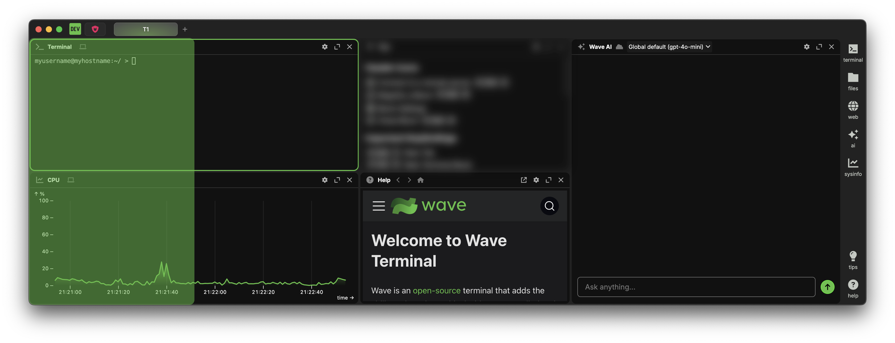
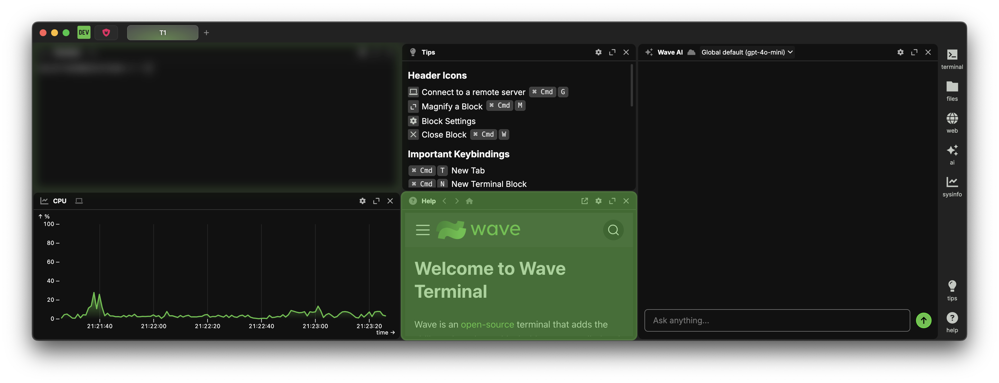
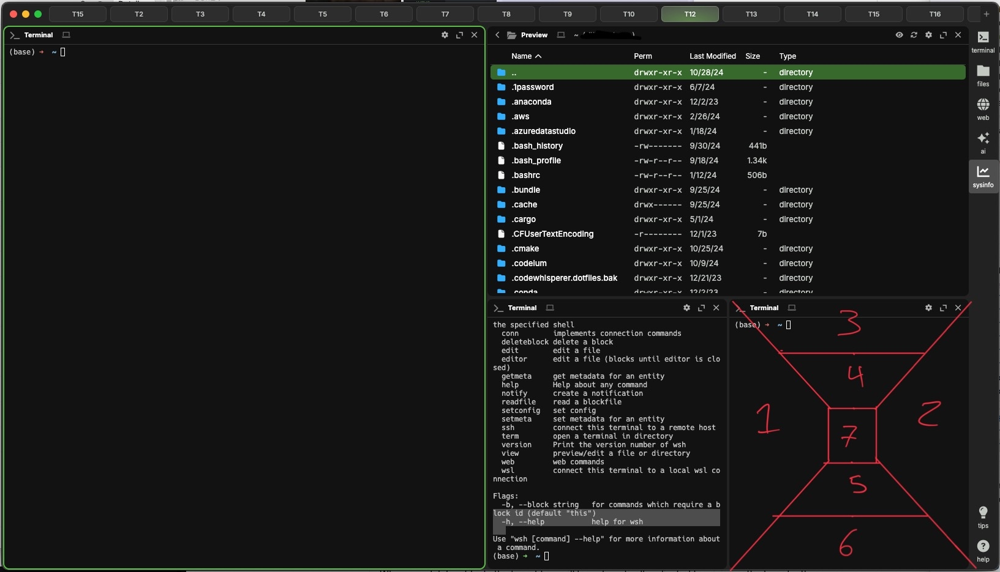

import { PlatformProvider, PlatformSelectorButton } from "@site/src/components/platformcontext.tsx";
import { Kbd } from "@site/src/components/kbd.tsx";

<PlatformProvider>
<PlatformSelectorButton/>

## Layout system under the hood

:::info

**Definitions**

- Layout tree: the in-memory representation of a tab layout, comprised of nodes
- Node: An entry in the layout tree, either a single block (a leaf) or an ordered list of nodes. Defines a tiling direction (row or column) and a unitless size
- Block: The contents of a leaf in the layout tree, defines what contents is displayed at the given layout location

:::

Our layout system emulates the [CSS Flexbox](https://developer.mozilla.org/en-US/docs/Web/CSS/CSS_flexible_box_layout/Basic_concepts_of_flexbox) system, comprising of a tree of columns and rows. Under the hood, the layout is represented as an n-tree, where each node in the tree is either a single block, or a list of nodes. Each level in the tree alternates the direction in which it tiles (level 1 tiles as a row, level 2 as a column, level 3 as a row, etc.).

## Layout actions

### Add a new block

You can add new blocks by selecting a widget from the right sidebar.

Starting at the topmost level of the tree, since the first level tiles as a row, new blocks will be added to the right side of existing blocks. Once there are 5 blocks across, new blocks will begin being added below existing blocks, starting from the right side and working to the left. As a new block gets added below an existing one, the node containing the existing block is converted from a single-block node to a list node and the existing block definition is moved one level deeper in the tree as the first element of the node list. New blocks will always be added to the last-available node in the deepest level, where available is defined as having less than five children. We don't set a limit on the number of blocks in a tab, but you may experience degraded performance past around 25 blocks.

While we define a 5-child limit for each node in the tree when automatically placing new blocks, there is no actual limit to the number of children a node can hold. After the block is placed, you are free to move it wherever in the layout

### Delete a block

You can delete blocks by clicking the <i className="fa-sharp fa-xmark-large"/> button in the top-right corner of the block, by right-clicking on the block header and selecting "Close Block" from the context menu, or by running the [`wsh deleteblock` command](./wsh#deleteblock). Alternatively, the currently focused block/widget can be closed by pressing <Kbd k="Cmd:w"/>

When you delete a block, the layout tree will be automatically adjusted to minimize the tree depth.

### Move a block

You can move blocks by clicking on the block header and dragging the block around the tab. You will see placeholders appear to show where the block will land when you drop it.

There are 7 different drop targets for any given block. A block is divided into quadrants along its diagonals. If the block is tiling as a row (left-to-right), dropping a block into the left or right quadrant will place the dropped block in the same level as the targeted block. This can be considered dropping the block inline. If you drop the block out of line (in quadrants corresponding to opposite tiling direction), the block will either be placed one level above or one level below the targeted block. Dropping the block towards the outside will place it in the same level as the target block's parent, while dropping it towards the center of the block will create a new level, where both the target block and the dropped block will be moved. The middle fifth of the block is reserved for the swap action. Dropping a block here will cause the target block and the dropped block to swap positions in the layout.

<video width="100%" height="100%" playsinline autoplay muted controls>
  <source src="./img/drag-move-24fps-crf43.mp4" type="video/mp4" />
</video>

#### Possible block movements

:::note
All block movements except for Swap will cause the rest of the layout to shift to accommodate the block's new displacement.
:::

1. Inline before: Drops the block under the same node as the target block, placing it before the target in the same tiling direction
2. Inline after: Drops the block under the same node as the target block, placing it after the target in the same tiling direction
3. Out-of-line before outer: Drops the block before the target block's parent node in the opposite tiling direction
4. Out-of-line before inner: Segments the target block, creating a new node in the tree. Places the dropped block before the target block in the opposite tiling direction.
5. Out-of-line after inner: Segments the target block, creating a new node in the tree. Places the dropped block after the target block in the opposite tiling direction.
6. Out-of-line after outer: Drops the block after the target block's parent node in the opposite tiling direction
7. Swap: Swaps the position of the dropped block and the targeted block in the layout, preserving the rest of the layout

### Resize a block

<video width="100%" height="100%" playsinline autoplay muted controls>
  <source src="./img/resize-24fps-crf43.mp4" type="video/mp4" />
</video>

You do not directly resize a block. Rather, you resize the nodes containing the blocks. If you hover your mouse over the margin of a block, you will see the cursor change to <i className="fa-sharp fa-arrows-left-right"/> or <i className="fa-sharp fa-arrows-up-down"/> to indicate the direction the node can be resized. You will also see a line appear after 500ms to show you how many blocks will be resized by moving that margin. Clicking and dragging on this margin will cause the block(s) to get resized.

Node sizes are unitless values. The ratio of all node sizes at a given tree level determines the displacement of each node. If you move a block and its node is deleted, the other nodes at the given tree level will adjust their sizes to account for the new size ratio.

## Change the gap size between blocks

The gap between blocks defaults to 3px, but this value can be changed by modifying the `window:tilegapsize` configuration value. See [Configuration](./config) for more information on how to change configuration values.

</PlatformProvider>
