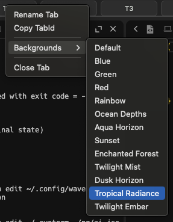
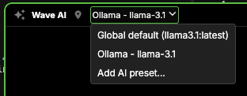

Presets can be used to apply multiple setting overrides at once to either a tab or a block. They are currently supported in two scenarios: tab backgrounds and AI models.

You can set presets either by placing them in `~/.config/waveterm/presets.json` or by placing them in a JSON file in the `~/.config/waveterm/presets/` directory. All presets will be aggregated regardless of which file they're placed in so you can use the `presets` directory to organize them as you see fit.

:::info

You can open up the main presets config file in Wave by running:

```
wsh editconfig presets.json
```

:::

## File format

Presets follow the following format:

```json
{
	...
	"<preset-type>@<preset-key>": {
		"display:name": "<Preset name>",
		"display:order": "<number>", // optional
		"<overridden-config-key-1>": "<overridden-config-value-1>"
		...
	}
}
```

A complete example of a preset for a tab background is the following:

```json
{
  "bg@rainbow": {
    "display:name": "Rainbow",
    "display:order": 2.1,
    "bg:*": true,
    "bg": "linear-gradient( 226.4deg,  rgba(255,26,1,1) 28.9%, rgba(254,155,1,1) 33%, rgba(255,241,0,1) 48.6%, rgba(34,218,1,1) 65.3%, rgba(0,141,254,1) 80.6%, rgba(113,63,254,1) 100.1% )",
    "bg:opacity": 0.3
  }
}
```

A complete example of a preset for an AI model is the following:

```json
{
  "ai@wave": {
    "display:name": "Ollama - llama3.1",
    "display:order": 0,
    "ai:baseurl": "http://localhost:11434",
    "ai:model": "llama3.1:latest"
  }
}
```

## Preset Types

The type of the preset determines where it can be discovered in the app. Currently, the two types that will be discovered in the app are `bg` and `ai`.

`bg` will be served in the "Backgrounds" submenu of the Tab context menu (which can be found by right-clicking on a tab).



`ai` will be served in the models dropdown in the block header of the "Wave AI" widget.



### Available configuration keys

The following configuration keys are available for use in presets:

#### Common keys

| Key Name      | Type   | Function                                                               |
| ------------- | ------ | ---------------------------------------------------------------------- |
| display:name  | string | the name to use when displaying the preset in a menu (required)        |
| display:order | float  | the order in which the preset should be displayed in a menu (optional) |

:::info

Configs in a preset are applied in order to override the default config values, which will persist for the remainder of the tab or block's lifetime. Setting `bg:*` or `ai:*` to `"true"` will clear the values of any previously overridden Background or AI configurations, respectively, setting them back to their defaults. You almost always want to add these keys to your presets in order to create a clean slate and prevent previously set values from leaking in.

:::

## AI Configurations

| Key Name      | Type   | Function                                                                                           |
| ------------- | ------ | -------------------------------------------------------------------------------------------------- |
| ai:\*         | bool   | reset all existing ai keys                                                                         |
| ai:preset     | string | the default AI preset to use                                                                       |
| ai:baseurl    | string | Set the AI Base Url (must be OpenAI compatible)                                                    |
| ai:apitoken   | string | your AI api token                                                                                  |
| ai:apitype    | string | defaults to "open_ai", but can also set to "azure" (for special Azure AI handling), or "anthropic" |
| ai:name       | string | string to display in the Wave AI block header                                                      |
| ai:model      | string | model name to pass to API                                                                          |
| ai:apiversion | string | for Azure AI only (when apitype is "azure", this will default to "2023-05-15")                     |
| ai:orgid      | string |                                                                                                    |
| ai:maxtokens  | int    | max tokens to pass to API                                                                          |
| ai:timeoutms  | int    | timeout (in milliseconds) for AI calls                                                             |

<a name="background-configurations" />

## Background Configurations

Wave's background system harnesses the full power of CSS backgrounds, letting you create rich visual effects through the "background" attribute. You can apply solid colors, gradients (both linear and radial), images, and even blend multiple elements together. The system offers preset configurations while maintaining the flexibility of pure CSS, making it both powerful and easy to use.

| Key Name             | Type   | Function                                                                                                |
| -------------------- | ------ | ------------------------------------------------------------------------------------------------------- |
| bg:\*                | bool   | reset all existing bg keys (recommended to prevent any existing background settings from carrying over) |
| bg                   | string | CSS `background` attribute for the tab (supports colors, gradients images, etc.)                        |
| bg:opacity           | float  | the opacity of the background (defaults to 0.5)                                                         |
| bg:blendmode         | string | the [blend mode](https://developer.mozilla.org/en-US/docs/Web/CSS/blend-mode) of the background         |
| bg:bordercolor       | string | the color of the border when a block is not active (rarely used)                                        |
| bg:activebordercolor | string | the color of the border when a block is active                                                          |

### Simple solid color with opacity:

```json
{
  "bg@blue": {
    "display:name": "Blue",
    "bg:*": true,
    "bg": "blue",
    "bg:opacity": 0.3,
    "bg:activebordercolor": "rgba(0, 0, 255, 1.0)"
  }
}
```

### Complex gradient combining multiple effects:

```json
{
  "bg@duskhorizon": {
    "display:name": "Dusk Horizon",
    "bg:*": true,
    "bg": "linear-gradient(0deg, rgba(128,0,0,1) 0%, rgba(204,85,0,0.7) 20%, rgba(255,140,0,0.6) 45%, rgba(160,90,160,0.5) 65%, rgba(60,60,120,1) 100%), radial-gradient(circle at 30% 30%, rgba(255,255,255,0.1), transparent 60%), radial-gradient(circle at 70% 70%, rgba(255,255,255,0.05), transparent 70%)",
    "bg:opacity": 0.9,
    "bg:blendmode": "overlay"
  }
}
```

### Repeating pattern background:

```json
{
  "bg@pattern": {
    "display:name": "Diamond Pattern",
    "bg:*": true,
    "bg": "url('/path/to/pattern.png') repeat",
    "bg:opacity": 0.15
  }
}
```

### Full-cover background image:

```json
{
  "bg@cover": {
    "display:name": "Ocean Scene",
    "bg:*": true,
    "bg": "url('/path/to/ocean.jpg') center/cover no-repeat",
    "bg:opacity": 0.2
  }
}
```

Replace image URLs with your own assets. All examples use reduced opacity to work well with dark themes.

:::info
Background images can be specified using URLs or local file paths. While URLs are supported, it's recommended to download and serve images locally for better reliability. For local files, you must use absolute paths or paths starting with `~` (e.g. `~/Downloads/background.png`). The system will automatically rewrite local paths to ensure proper access. We support all common web image formats: PNG, JPEG/JPG, WebP, GIF, and SVG.
:::

:::tip
You can use `wsh setbg --print` to help generate the JSON for your background presets. For example:

```bash
# Preview the metadata for a gradient background
 wsh setbg --print "#ff0000"
{
  "bg:*": true,
  "bg": "#ff0000",
  "bg:opacity": 0.5
}

# Preview a centered logo configuration
wsh setbg --print --center --opacity 0.3 ~/logo.png
{
  "bg:*": true,
  "bg": "url('/absolute/path/to/logo.png') no-repeat center/auto",
  "bg:opacity": 0.3
}
```

Copy the output and use it as a starting point for your preset configuration, just add the required `display:name` field!
:::

#### Unset a default value

To unset a default value in a preset, add an override that sets it to an empty string, like `""`.
